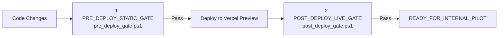

# Samsung Branch Operations Engineer Skill

## Mission Statement
This skill provides automated governance and strict engineering invariants for the Samsung Branch Operations Dashboard (Ayutthaya City Park). It eliminates regression cycles ("fixing one area while breaking another") by enforcing permanent project invariants, dynamic hash-bound stock fixtures, TypeScript Playwright acceptance tests, and decoupled static vs. live gate pipelines.

---

## 1. Permanent Project Invariants

Every change to this codebase must adhere to the following permanent invariants:

1. **Summary Cards Scope: Floor 1 Only (`F1_ONLY`)**
   - Summary cards at `/#/stock` represent walk-in inventory ready on Floor 1 (ร้านเรา ชั้น 1).
   - Under no circumstances may Floor 2 (`f2`) inventory be added into summary cards.
   - Primary title must display `สต๊อกทั้งหมด ชั้น 1`.
   - Unit labels must display `(ชั้น 1)` (e.g. `ชิ้น/เครื่อง (ชั้น 1)`). Never display `(F1 + F2)`.

2. **Product Table Scope: Detailed Floor 1, Floor 2, and Arithmetic Total**
   - The product table is the **only** UI component where Floor 2 (`f2`) inventory is presented to staff.
   - Columns:
     - `ร้านเรา (ชั้น 1)`: Floor 1 stock (`f1`)
     - `สาขา (ชั้น 2)`: Floor 2 warehouse stock (`f2`)
     - `รวมสต็อก`: Total inventory (`total = f1 + f2`)

3. **Hierarchical Category Resolution**
   - Product classification follows strict priority:
     $$\text{Category 1} \longrightarrow \text{Category 2} \longrightarrow \text{Category 3} \longrightarrow \text{Brand}$$
   - **Galaxy Buds Precedence**: Galaxy Buds must be evaluated before Smartphone (AUDIO + HEADPHONE + TRUE WIRELESS + SAMSUNG, or SM-R* / BUDS in description).
   - **Non-Hardware Suppression**: `SIM` and `Other` products are permanently suppressed from summary cards.

4. **Exact Product Spec Identity & Field-Level Verification**
   - Strict matching on `brand`, `productType`, and `manufacturerModel`.
   - Accessory items must never borrow or inherit flagship phone attributes.
   - For Soundcore Select 4 Go (`194644055783`, `194644200176`):
     - Model: `A31X1`
     - Status: `PARTIALLY_VERIFIED`
     - Verified: 5W, IP67, 20h playtime, TWS, built-in strap, floating design.
     - Blocked unverified claims: Bluetooth 5.4 and Thailand 18-month warranty must be suppressed (displayed with caution/placeholder text) until vendor lab certificates are provided.
     - Anti-leakage: Zero mentions of Galaxy A07, Helio G85, or Knox security.

5. **Fail-Closed Unknown Product Policy**
   - Unrecognized items without verified specifications must fail closed (return `null` / display `SPEC_NOT_VERIFIED`).
   - Generic fallback to Galaxy A07 is permanently eradicated.

6. **Baseline Freeze (`a7c3390` / `4dd91b1`)**
   - Core production baseline files (`index.html`, `app.js`, `style.css`, `runtime_manifest.json`) are frozen.
   - Pilot features live in pilot layers (`pilot.html`, `assets/js/prototype-stock.js`, `product_specs_data.js`).

7. **Member Admin Route Isolation (`/#/admin/members`)**
   - Strict DOM lifecycle isolation: `#view-admin-members` must never render underneath or bleed through `#view-stock` or other views.
   - Accessible only to authorized branch roles (`STORE_LEADER`, `STORE_MANAGER`, `SYSTEM_ADMIN`).

8. **Strict Credential Hygiene**
   - Zero hardcoded passwords, tokens, or plaintext secrets in source code, test files, console logs, or walkthrough documents.
   - Credentials must be read strictly from environment variables:
     - `TEST_ADMIN_EMPLOYEE_ID`
     - `TEST_ADMIN_PASSWORD`
     - `TEST_MEMBER_EMPLOYEE_ID`
     - `TEST_MEMBER_PASSWORD`

---

## 2. Dynamic Fixtures Bound by Source Hash

Stock figures are **not** hardcoded permanent business rules. When an Excel stock master is updated, inventory numbers change, but the underlying invariants remain intact:

| Element | Nature | Behavior on New Excel Upload |
|---|---|---|
| **F1-Only Rule** | Permanent Invariant | **Never changes** |
| **Suppression of SIM / Other Cards** | Permanent Invariant | **Never changes** |
| **Category Resolver Hierarchy** | Permanent Invariant | **Never changes** |
| **Expected Category Numbers** | Dynamic Acceptance Fixture | **Rebuilt automatically from Excel** |
| **Source SHA-256 Hash** | Acceptance Binding | **Changes per uploaded file** |

### Acceptance Fixture Schema (`fixtures/stock_snapshot_acceptance.json`)
```json
{
  "fixtureType": "SNAPSHOT_ACCEPTANCE",
  "sourceFilename": "stock(1).xlsx",
  "sourceSha256": "eef4c2ee7a111333a1e2e5d85f40fbbf48512d97feae1415d1cc6e792782e799",
  "expected": {
    "f1Total": 1701,
    "smartphone": 230,
    "tablet": 34,
    "watch": 61,
    "buds": 49,
    "accessory": 972,
    "premium": 282
  }
}
```

### Terminology Rules: Units ("ชิ้น") vs P/Ns ("รายการ")
Never confuse physical inventory units with unique catalog part numbers:
- **SIM**: Quantity = **58 ชิ้น (Units)** across **11 รายการ (Distinct P/Ns)**.
  - *Prohibited*: Never say "SIM 58 รายการ".
  - *Correct*: **"SIM 58 ชิ้น (11 รายการ P/N)"**.
- **Other**: Quantity = **15 ชิ้น (Units)** across **9 รายการ (Distinct P/Ns)**.
  - *Correct*: **"Other 15 ชิ้น (9 รายการ P/N)"**.

To re-generate the acceptance fixture after uploading a new Excel file:
```bash
python .agents/skills/samsung-branch-operations-engineer/scripts/build_stock_fixture.py <new_excel_file>
```

---

## 3. TypeScript + Playwright UI Test Suite (`tests/ui/`)

Browser testing is performed via native TypeScript Playwright specifications:

| Test Specification | Focus & Enforced Invariants |
|---|---|
| [`tests/ui/stock-summary.spec.ts`](file:///c:/Users/JarNJay/.gemini/antigravity-ide/scratch/samsung-stock-dashboard/.agents/skills/samsung-branch-operations-engineer/tests/ui/stock-summary.spec.ts) | F1-only totals (1701, 230, 34, 61, 49, 972, 282), SIM card hidden, Other card hidden, 7 cards visible, 0 console errors, 0 404s. |
| [`tests/ui/stock-table.spec.ts`](file:///c:/Users/JarNJay/.gemini/antigravity-ide/scratch/samsung-stock-dashboard/.agents/skills/samsung-branch-operations-engineer/tests/ui/stock-table.spec.ts) | F1, F2, Total headers; row arithmetic (`Total == F1 + F2`); category filtering. |
| [`tests/ui/product-spec-drawer.spec.ts`](file:///c:/Users/JarNJay/.gemini/antigravity-ide/scratch/samsung-stock-dashboard/.agents/skills/samsung-branch-operations-engineer/tests/ui/product-spec-drawer.spec.ts) | Soundcore A31X1 `PARTIALLY_VERIFIED`, 5W, IP67, 20h, TWS; unverified BT 5.4 / warranty suppressed; 0 Galaxy A07 leakage; unknown item fail-closed. |
| [`tests/ui/member-admin.spec.ts`](file:///c:/Users/JarNJay/.gemini/antigravity-ide/scratch/samsung-stock-dashboard/.agents/skills/samsung-branch-operations-engineer/tests/ui/member-admin.spec.ts) | `/#/admin/members` route isolation; complete hiding of `#view-stock`; clean toggle back to stock. |
| [`tests/ui/session-restore.spec.ts`](file:///c:/Users/JarNJay/.gemini/antigravity-ide/scratch/samsung-stock-dashboard/.agents/skills/samsung-branch-operations-engineer/tests/ui/session-restore.spec.ts) | Authenticated session restoration across browser reloads without forcing re-login. |

To run the Playwright test suite:
```bash
npx playwright test --config=.agents/skills/samsung-branch-operations-engineer/playwright.config.ts
```

---

## 4. Two-Stage Decoupled Gateways

Release qualification is strictly divided into two decoupled gates:



### Stage 1: `PRE_DEPLOY_STATIC_GATE`
- **Script**: `scripts/pre_deploy_gate.ps1`
- **Automated Validations**:
  1. Baseline Freeze Check (`runtime_manifest.json` against `a7c3390`)
  2. Excel Master Reconciliation against hash-bound fixture
  3. Product Spec Identity & Field-Level Verifier
  4. Secret Scanner & Credential Hygiene
  5. Comprehensive CI Quality Gates (12/12)
  6. Rebuild Dedicated Pilot Package (`samsung_stock_dashboard_feedback_pilot.zip`)
  7. Pilot & Runtime ZIP SHA-256 Manifest Verification
- **Success Status**: `READY_FOR_PREVIEW_DEPLOYMENT`

### Stage 2: `POST_DEPLOY_LIVE_GATE`
- **Script**: `scripts/post_deploy_gate.ps1`
- **Automated Validations**:
  1. Target Preview URL verification
  2. Environment credential hygiene check
  3. Execution of full TypeScript + Playwright UI test suite against live URL:
     - Root entrypoint & authentication
     - Dashboard & stock navigation
     - F1-only summary cards & SIM/Other suppression
     - Product table F1, F2, Total arithmetic
     - Spec Drawer field-level verification & fail-closed
     - Member Admin route isolation
     - Session restore across page reloads
     - Zero console errors & zero network 404s
- **Success Status**: `READY_FOR_INTERNAL_PILOT`

---

## 5. Directory Layout

```
samsung-branch-operations-engineer/
├── SKILL.md
├── playwright.config.ts
├── references/
│   ├── project_rules.json
│   ├── stock_rules.md
│   ├── category_rules.md
│   ├── spec_verification_rules.md
│   ├── accessory_spec_rules.md
│   ├── member_admin_rules.md
│   ├── release_governance.md
│   ├── post_pilot_governance_and_field_evidence.md
│   ├── marketplace_evidence_rules.md
│   └── end_to_end_product_spec_verification_sop.md
├── fixtures/
│   ├── stock_snapshot_acceptance.json
│   ├── category_regressions.json
│   ├── spec_identity_regressions.json
│   ├── route_regressions.json
│   └── shopee_official_regressions.json
├── scripts/
│   ├── build_stock_fixture.py
│   ├── verify_project_rules.py
│   ├── verify_stock_reconciliation.py
│   ├── verify_spec_identity.py
│   ├── verify_live_manifest.py
│   ├── verify_marketplace_evidence.py
│   ├── pre_deploy_gate.ps1
│   └── post_deploy_gate.ps1
└── tests/
    └── ui/
        ├── test-helper.ts
        ├── stock-summary.spec.ts
        ├── stock-table.spec.ts
        ├── member-admin.spec.ts
        ├── product-spec-drawer.spec.ts
        ├── accessory-spec-drawer.spec.ts
        ├── marketplace-evidence.spec.ts
        ├── sales-ready-drawer.spec.ts
        └── session-restore.spec.ts
```

---

## 6. Pre-Close Verification Checklist
Before completing any engineering task or declaring a release candidate ready:
- [ ] Reviewed project rules in `references/project_rules.json`.
- [ ] Verified baseline files (`index.html`, `app.js`, `style.css`) remain frozen (`a7c3390`).
- [ ] Confirmed dynamic stock fixture matches uploaded Excel SHA-256 hash.
- [ ] Verified category hierarchy follows Cat1 -> Cat2 -> Cat3 -> Brand (Buds precedence).
- [ ] Confirmed summary cards display F1 only (`สต๊อกทั้งหมด ชั้น 1`).
- [ ] Confirmed SIM (58 ชิ้น, 11 รายการ P/N) and Other (15 ชิ้น, 9 รายการ P/N) cards are hidden.
- [ ] Confirmed table displays F1, F2, and Total (`total = f1 + f2`).
- [ ] Verified Soundcore Select 4 Go is `PARTIALLY_VERIFIED` with unproven BT 5.4 / warranty suppressed.
- [ ] Confirmed unknown items fail closed (`SPEC_NOT_VERIFIED`) with zero Galaxy A07 fallback.
- [ ] Scanned repository for zero plaintext credentials in source code or tests.
- [ ] Passed `PRE_DEPLOY_STATIC_GATE` (`scripts/pre_deploy_gate.ps1`) $\longrightarrow$ `READY_FOR_PREVIEW_DEPLOYMENT`.
- [ ] Passed `POST_DEPLOY_LIVE_GATE` (`scripts/post_deploy_gate.ps1`) with 5-stage automated gate (100% SHA-256 live file match, Accessory Master integrity, and 11 Playwright UI specs) $\longrightarrow$ `READY_FOR_INTERNAL_PILOT`.
- [ ] Confirmed compliance with Post-Pilot Governance & Field Evidence Protocol (`references/post_pilot_governance_and_field_evidence.md`) $\longrightarrow$ `PRODUCTION = HOLD`.
