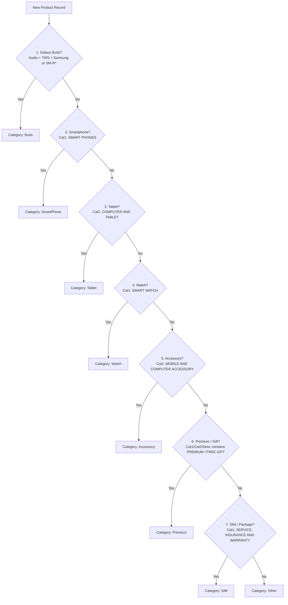

# Category Hierarchy and Classification Rules

## 1. Core Principle: Hierarchical Resolution
Product classification follows a strict priority chain:
$$\text{Category 1} \longrightarrow \text{Category 2} \longrightarrow \text{Category 3} \longrightarrow \text{Brand}$$

Part Numbers (P/N) and Model strings serve only as secondary validation or disambiguation cues and must **never** override explicit Category 1/2 hierarchy.

---

## 2. Classification Resolution Order

The classification pipeline must evaluate categories in this exact chronological order:

### 1. Galaxy Buds (Priority 1 - Must precede Smartphone)
- Condition: `(Cat1 == 'AUDIO' AND Cat2 == 'HEADPHONE' AND Cat3 == 'TRUE WIRELESS' AND 'SAMSUNG' in Brand) OR ('SAMSUNG' in Brand AND (PN starts with 'SM-R4'|'SM-R5'|'SM-R6' OR 'BUDS' in Desc))`
- Target Category: `Buds`

### 2. Smartphone
- Condition: `Cat1 IN ('SMART PHONES', 'SMARTPHONES', 'SMART PHONE', 'SMART_PHONES', 'SMART_PHONE')`
- Target Category: `SmartPhone`

### 3. Tablet
- Condition: `Cat1 IN ('COMPUTER AND TABLET', 'COMPUTER_AND_TABLET', 'TABLET', 'TABLETS', 'TAB')`
- Target Category: `Tablet`

### 4. Smart Watch
- Condition: `Cat1 IN ('SMART WATCH', 'SMART_WATCH', 'SMARTWATCH', 'WATCH')`
- Target Category: `Watch`

### 5. Accessory
- Condition: `Cat1 IN ('MOBILE AND COMPUTER ACCESSORY', 'MOBILE_AND_COMPUTER_ACCESSORY', 'ACCESSORY', 'ACCESSORIES', 'ADAPTER')`
- Target Category: `Accessory`

### 6. Premium
- Condition: `'PREMIUM' IN Cat1/Cat2/Desc OR 'FREE GIFT' IN Cat2/Desc OR 'GIFT' IN Cat1`
- Target Category: `Premium` (Rendered as summary card on dashboard)

### 7. SIM
- Condition: `'SERVICE, INSURANCE AND WARRANTY' IN Cat1 OR 'SIM' IN Cat1/Cat2 OR 'CARRIER MOBILE PACKAGE' IN Cat2`
- Target Category: `SIM` (Suppressed from summary cards)

### 8. Other
- Condition: Any unclassified item.
- Target Category: `Other` (Suppressed from summary cards)

---

## 3. Invariants & Fail-Closed Guardrails
1. **Never misclassify Buds as Smartphone**: Evaluation order ensures Buds are captured before Smartphone Cat1 matching can trigger.
2. **Never expose SIM or Other as summary cards**: They remain queryable in the stock table and dropdown filters, but never populate card metrics.
3. **Never allow cross-brand bleeding**: Soundcore, Apple, or 3rd-party accessories must preserve their actual brand and never be coerced into Samsung flagship categories.
