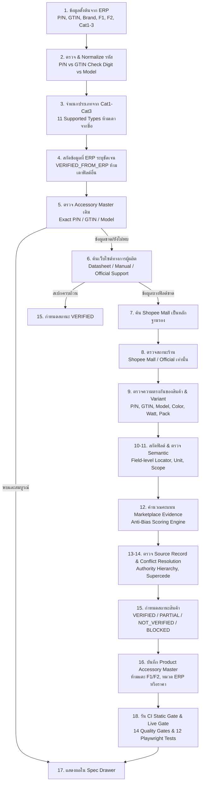

# ขั้นตอนตรวจสอบสินค้าแบบละเอียดตั้งแต่ไฟล์สต๊อกจนถึงการเผยแพร่ใน Product Accessory Master

เอกสารฉบับนี้เป็นคู่มือปฏิบัติการมาตรฐาน (Standard Operating Procedure: SOP) และข้อกำหนดทางวิศวกรรมสำหรับสาขาอยุธยา ซิตี้พาร์ค (Ayutthaya City Park) ในการตรวจสอบ รวบรวมหลักฐาน จำแนกสเปก และบันทึกสินค้าลงสู่ **Product Accessory Master** โดยครอบคลุมทั้งสินค้า Samsung, อุปกรณ์เสริมแบรนด์ภายนอก (Third-party Accessories) และการใช้หลักฐานเสริมจากร้านทางการบน Marketplace (Shopee Mall / Official Stores) อย่างปลอดภัย 100%

---

## ภาพรวมกระบวนการ (Pipeline Flow)



---

## 1. รับข้อมูลตั้งต้นจาก ERP

เริ่มจากข้อมูลในไฟล์สต๊อก โดยเก็บค่าต้นทางไว้โดยไม่แก้ไข:
- `Inventory P/N`
- `GTIN หรือ Barcode`
- `Brand`
- `Description`
- `Cat1`, `Cat2`, `Cat3`
- `ราคาอ้างอิง (SRP)`
- `ร้านเรา (ชั้น 1) - F1`
- `สาขา (ชั้น 2) - F2`

> [!CAUTION]
> **กฎเหล็กถาวร (Permanent Invariant)**:
> ข้อมูลจากเว็บไซต์หรือ Marketplace ห้ามเปลี่ยน:
> - `F1` (สต๊อกชั้น 1)
> - `F2` (สต๊อกชั้น 2)
> - `ยอดรวมสต๊อก (Total)`
> - `Cat1`, `Cat2`, `Cat3` (หมวดหมู่ ERP)
> - `ราคา ERP (SRP)`
> - `Inventory P/N`
>
> หากแหล่งภายนอกเขียนข้อมูลไม่ตรง ERP ให้บันทึกเป็น Conflict ไม่ใช่เขียนทับ ERP

---

## 2. ตรวจความถูกต้องของรหัสสินค้า

### 2.1 Normalize รหัส
ก่อนเปรียบเทียบ ให้ระบบ:
- ตัดช่องว่างหน้าและหลัง (Trim)
- แปลงอักษรภาษาอังกฤษเป็นตัวใหญ่ (Uppercase)
- ลบช่องว่างภายในที่ไม่จำเป็น
- **ห้ามลบขีด (`-`)** หากขีดเป็นส่วนหนึ่งของ Model Code ผู้ผลิต

```text
ep-t2510nbegth  -->  EP-T2510NBEGTH
EP-T2510NBEGTH  -->  EP-T2510NBEGTH
 EP-T2510NBEGTH -->  EP-T2510NBEGTH
```

### 2.2 แยกชนิดของรหัส
1. **Inventory P/N**: รหัสที่ระบบ ERP หรือสาขาใช้บันทึกสต๊อก
2. **GTIN / Barcode**: รหัสตัวเลขสากล 8, 12, 13 หรือ 14 หลักที่ผ่านการตรวจ Check Digit ตามมาตรฐาน GS1
3. **Manufacturer Model**: รหัสรุ่นของผู้ผลิต เช่น `A31X1` (Soundcore) หรือ `EP-T2510` (Samsung)

> [!WARNING]
> ห้ามสรุปว่ารหัสตัวเลขทุกชุดเป็น GTIN โดยไม่ตรวจ Check Digit

---

## 3. จำแนกประเภทสินค้าจาก Cat1–Cat3

ใช้ลำดับการวิเคราะห์:
$$\text{Cat1} \longrightarrow \text{Cat2} \longrightarrow \text{Cat3} \longrightarrow \text{Brand} \longrightarrow \text{P/N ยืนยัน} \longrightarrow \text{Description (Fallback สุดท้าย)}$$

### 11 ประเภทสินค้าที่รองรับ (Supported Product Types):
1. `WALL_CHARGER` (อะแดปเตอร์ชาร์จเร็ว / หัวชาร์จ)
2. `DATA_CABLE` (สายชาร์จและส่งข้อมูล)
3. `POWER_BANK` (แบตเตอรี่สำรอง)
4. `PHONE_CASE` (เคสสมาร์ทโฟน)
5. `TABLET_CASE` (เคสแท็บเล็ต)
6. `SCREEN_PROTECTOR` (กระจกกันรอย / ฟิล์มปกป้องหน้าจอ)
7. `WATCH_BAND` (สายนาฬิกาสมาร์ตวอตช์)
8. `BLUETOOTH_SPEAKER` (ลำโพงไร้สายบลูทูธ)
9. `EARBUDS` (หูฟัง TWS / หูฟังสมอลทอล์ก)
10. `PREMIUM_GIFT` (ของพรีเมียม / ของแถมทางการ)
11. `UNKNOWN_ACCESSORY` (ไม่ทราบประเภท - Fail-closed)

> [!IMPORTANT]
> ห้ามเลือก Template จากคำในชื่ออย่างเดียว เช่น ชื่อมีคำว่า “Galaxy” ไม่ได้หมายความว่าเป็น Smartphone ต้องดูประเภทสินค้าที่แท้จริง

---

## 4. สกัดข้อมูลที่ ERP ระบุชัดเจน

ค่าที่เขียนระบุชัดเจนใน Description ของ ERP สามารถบันทึกเป็น `VERIFIED_FROM_ERP`:

*ตัวอย่าง:*
- Description: `iLinio C to C Cable 100W 2 units 1M - Black`
- สกัดได้ทันที:
  - `connectorA`: `USB-C`
  - `connectorB`: `USB-C`
  - `maximumPower`: `100W`
  - `packageQuantity`: `2 เส้น`
  - `length`: `1 เมตร`
  - `color`: `Black`

*ฟิลด์ที่ห้ามเดาเองเด็ดขาด:*
- `usbVersion` (USB 2.0 / 3.2?)
- `dataTransferSpeed` (480 Mbps / 10 Gbps?)
- `pdVersion` (PD 3.0 / 3.1?)
- `eMarkerChip` (มีหรือไม่มี?)
- `videoOutput` (รองรับหรือไม่?)
- `cableMaterial` (Braided Nylon / TPE?)

---

## 5. ตรวจ Product Accessory Master ก่อนค้นเว็บ

ระบบต้องค้นตามลำดับความแม่นยำ:
1. Exact Inventory P/N
2. Exact GTIN (Barcode)
3. Approved Manufacturer Model + Brand
4. หากไม่พบ $\longrightarrow$ `SPEC_NOT_VERIFIED`

### เกณฑ์การตรวจสอบความสอดคล้อง:
- แบรนด์ตรงกัน
- Product Type ตรงกัน
- Manufacturer Model ไม่ขัดแย้ง
- Variant (สี/ความจุ/กำลังไฟ) ตรงกัน
- Record ไม่ได้ถูกระงับ (Archived)

| สถานการณ์ | ผลการตัดสิน | การกระทำ |
| :--- | :--- | :--- |
| ตรงทุกข้อ | **PASS** | ดึงข้อมูล Master Record ไปแสดงผล |
| P/N ตรง แต่ Brand ไม่ตรง | **BLOCKED_CONFLICT** | ปิดกั้นการแสดงผล ไม่ให้ข้อมูลข้ามแบรนด์ |
| P/N ตรง แต่ Product Type ไม่ตรง | **BLOCKED_CONFLICT** | ปิดกั้นการแสดงผล ไม่ให้สเปกข้ามหมวด |
| ไม่พบ Exact Identity | **SPEC_NOT_VERIFIED** | แสดงข้อมูล ERP พื้นฐาน ระบุสถานะยังไม่ยืนยัน |

---

## 6. ค้นหาเว็บไซต์ทางการของผู้ผลิตก่อนเสมอ

คำค้นเรียงจากเฉพาะเจาะจงไปหากว้าง:
1. `Exact P/N`
2. `Exact GTIN`
3. `Brand + Manufacturer Model`
4. `Brand + Product Name + Variant`

### แหล่งข้อมูลลำดับความน่าเชื่อถือสูง:
- Manufacturer Product Page
- Manufacturer Support / Specification Page
- Official User Manual / Guide
- Official Technical Datasheet
- National Authorized Distributor ที่ได้รับการแต่งตั้ง
- เอกสารบรรจุภัณฑ์บนกล่องจริงหรือใบรับประกัน

---

## 7. ค้นหา Shopee เมื่อข้อมูลผู้ผลิตไม่ครบถ้วน

ให้ค้น Shopee เป็น **"หลักฐานเสริม (Secondary Evidence)"** หลังจากค้นหาผู้ผลิตแล้วยังมีบางฟิลด์ที่จำเป็นขาดอยู่

### ลำดับการเลือกร้านบน Shopee:
1. **Shopee Mall Official Brand Store** (เช่น `ADAM elements Official Store`)
2. **Shopee Mall Authorized Distributor** (ผู้แทนจำหน่ายทางการ)
3. ร้านค้าที่แบรนด์ระบุรับรองบนเว็บไซต์ทางการ
4. ร้านค้าชื่อเสียงสูงที่มีข้อมูลจากหลายแหล่งตรงกัน
5. *ร้านค้าทั่วไป*: ใช้เป็นเบาะแสในการสืบค้นเท่านั้น **ห้ามนำมาอ้างอิงสเปก**

---

## 8. ตรวจสอบสถานะและความน่าเชื่อถือของร้านค้า

ต้องบันทึกเมทาดาทาของร้านค้า:
- ชื่อร้านค้า (`shopName`)
- URL หน้าร้าน (`shopUrl`)
- สถานะ Shopee Mall (`isMall: true/false`)
- สถานะ Official Store (`isOfficial: true/false`)
- แบรนด์ทางการที่ผูกกับร้าน
- คะแนนรีวิวและจำนวนผู้ติดตาม (เก็บเป็นบริบทประกอบ)
- วันที่และเวลาที่เข้าตรวจ (`checkedAt`)

> [!WARNING]
> **Anti-Follower Bias Guard**:
> - ผู้ติดตามสูง $\neq$ Exact รุ่นตรง
> - ยอดขายสูง $\neq$ สเปกถูกต้อง
> - รีวิวมาก $\neq$ Variant เดียวกับ ERP
>
> ร้านค้าที่ไม่ใช่ Mall/Official แม้จะมีผู้ติดตามหลักแสน จะได้รับคะแนนสูงสุดเพียง `MARKETPLACE_SUGGESTED_REVIEW_REQUIRED` หรือ `REJECTED_EVIDENCE` เท่านั้น **ไม่มีสิทธิ์ได้ `VERIFIED` หรือ `SUPPORTED_BY_OFFICIAL_MARKETPLACE`**

---

## 9. ตรวจสอบหน้ารายการสินค้าบน Shopee

### 9.1 ตรวจสอบ Identity สินค้า
- Exact P/N หรือ GTIN ตรงกับสต๊อกหรือไม่
- Brand ตรงหรือไม่
- Manufacturer Model ตรงหรือไม่
- Product Type ตรงหรือไม่

### 9.2 ตรวจสอบ Variant
ต้องเลือก Option ที่ตรงกับสต๊อกสาขาจริง:
- สี (Color)
- ความยาว (Length)
- กำลังไฟ (Wattage)
- จำนวนต่อแพ็ก (Package Quantity)
- รุ่นที่รองรับ (Compatibility)

```text
ERP:            100W / 1M / 2 เส้น / Black
Shopee Option:  60W / 2M / 1 เส้น / White
ผลการตัดสิน:    VARIANT_MISMATCH --> ปฏิเสธข้อมูลทันที
```
*หากหน้าสินค้ารวมหลาย Variant โดยไม่ระบุว่าสเปกแต่ละข้อผูกกับ Variant ใด ให้ถือเป็น `VARIANT_AMBIGUOUS` $\longrightarrow$ `MARKETPLACE_SUGGESTED_REVIEW_REQUIRED`*

---

## 10. สกัดข้อมูลเป็นรายฟิลด์ (Field-Level Specification)

ห้ามนำข้อความในกล่อง Description ทั้งหมดมาแปะเป็นก้อนเดียว ต้องแยกเป็นรายฟิลด์ตาม Schema:

```json
{
  "maximumPower": {
    "value": 100,
    "unit": "W",
    "displayValue": "สูงสุด 100W (รองรับ PD 3.0)",
    "status": "SUPPORTED_BY_OFFICIAL_MARKETPLACE",
    "sourceId": "SRC-SHOPEE-ADAM-001",
    "evidenceLocator": "รายละเอียดสินค้า > กำลังไฟสูงสุด",
    "checkedAt": "2026-09-16"
  },
  "dataTransferSpeed": {
    "value": null,
    "unit": null,
    "displayValue": "ยังไม่ได้ยืนยัน",
    "status": "NOT_VERIFIED",
    "sourceId": null
  }
}
```

---

## 11. ตรวจสอบความหมายทางเทคนิค (Semantic Verification)

ป้องกันความเข้าใจผิดทางเทคนิค:
- ข้อความ `100W` อาจหมายถึง:
  - กำลังไฟที่สายรับได้จริง (`maximumPower`)
  - กำลังไฟของหัวชาร์จที่ใช้ทดสอบ
  - กำลังไฟรวมหลายพอร์ตรวมกัน
  - ข้อความโฆษณาทางการตลาด
- ต้องจับคู่ Semantic Field Key และตรวจสอบหน่วยวัดให้ตรงกับ Template
- หากความหมายกำกวม ให้ติดแท็ก `AI_SUGGESTED_REVIEW_REQUIRED`

---

## 12. การคำนวณคะแนน Marketplace Evidence (Anti-Bias Scoring)

ระบบใช้สูตรการคำนวณคะแนนหลักฐาน:

| เงื่อนไขการประเมิน | คะแนน |
| :--- | :--- |
| **Shopee Mall หรือ Official Brand Store** | **+35** |
| **Exact P/N หรือ GTIN ตรงกับสต๊อก** | **+25** |
| **Brand และ Manufacturer Model ตรง** | **+15** |
| **Product Type ตรงตามหมวดหมู่อุปกรณ์เสริม** | **+10** |
| **Variant (สี/ความยาว/กำลังไฟ) ตรงทุกจุด** | **+10** |
| **มีหลักฐานจากแหล่งที่สองยืนยันตรงกัน** | **+5** |
| *ไม่มี Exact P/N หรือ GTIN ในหน้าสินค้า* | *-30* |
| *Variant กำกวม หรือหน้ารวมหลายรุ่น* | *-20* |
| *ร้านค้าทั่วไปที่ไม่ได้รับการแต่งตั้งทางการ* | *-20* |

### เกณฑ์การตัดสิน (Evaluation Verdicts):
- **90 – 100 คะแนน**: `SUPPORTED_BY_OFFICIAL_MARKETPLACE` (หลักฐานสมบูรณ์จากร้านทางการ)
- **75 – 89 คะแนน**: `MARKETPLACE_SUGGESTED_REVIEW_REQUIRED` (ต้องมีคนตรวจยืนยันก่อนใช้)
- **ต่ำกว่า 75 คะแนน**: `REJECTED_EVIDENCE` (ปฏิเสธหลักฐาน ไม่นำเข้าระบบ)
- **Brand / Type ขัดแย้ง**: `BLOCKED_CONFLICT` (บล็อกทันที คะแนนเป็น 0)

---

## 13. การจัดเก็บข้อมูลแหล่งอ้างอิงรายฟิลด์ (Source Evidence Record)

ทุกฟิลด์ที่มีข้อมูลต้องผูกกับ `sourceId` โดยมีโครงสร้างดังนี้:

```json
{
  "sourceId": "SRC-SHOPEE-ADAM-001",
  "sourceType": "SHOPEE_MALL_OFFICIAL",
  "publisher": "ADAM elements Official Store",
  "platform": "Shopee Thailand",
  "url": "https://shopee.co.th/adamelements/item/xxx",
  "productIdentity": {
    "gtin": "4710343478157",
    "brand": "ADAM elements",
    "model": "iLinio C to C 100W"
  },
  "retrievedAt": "2026-09-16T06:00:00Z",
  "contentHash": "e3b0c44298fc1c149afbf4c8996fb92427ae41e4649b934ca495991b7852b855",
  "evidenceStatus": "SUPPORTED_BY_OFFICIAL_MARKETPLACE"
}
```

> [!CAUTION]
> **ความปลอดภัยและสุขอนามัยของข้อมูล**:
> ห้ามเก็บ Browser Cookies, Session Tokens, รหัสผ่าน หรือ Authorization Headers ใน Source Record เด็ดขาด

---

## 14. ลำดับอำนาจข้อมูลและการระงับความขัดแย้ง (Conflict Resolution)

ลำดับความน่าเชื่อถือของแหล่งข้อมูล (Authority Hierarchy):
$$\text{Manufacturer Official} > \text{Manufacturer Manual} > \text{Authorized Distributor} > \text{Shopee Mall Official} > \text{ERP Description} > \text{ร้านชื่อเสียงสูง} > \text{AI Suggestion}$$

- หาก Manufacturer ระบุกำลังไฟ `60W` แต่หน้า Shopee Mall ระบุ `100W`:
  - **ผลลัพธ์**: ยึดค่า `60W` จากผู้ผลิตเป็น `VERIFIED`
  - ข้อมูลจาก Shopee ถูกปรับสถานะเป็น `SUPERSEDED_CONFLICT`
  - **ห้ามเฉลี่ยค่า หรือเลือกค่าที่สูงกว่าเด็ดขาด**

---

## 15. การกำหนดสถานะความสมบูรณ์ของสินค้า (Product-Level Status)

1. **`VERIFIED`**:
   - Exact Identity ผ่าน
   - มีหลักฐานจากผู้ผลิตหรือเอกสารทางการครบทุก Required Fields
   - ปราศจาก Conflict
2. **`PARTIALLY_VERIFIED`**:
   - Exact Identity ผ่าน
   - มีสเปกที่ยืนยันแล้วบางส่วน (เช่น จาก ERP หรือ Shopee Mall)
   - ฟิลด์ที่ขาดระบุ `NOT_VERIFIED` อย่างชัดเจน
3. **`SPEC_NOT_VERIFIED`**:
   - ไม่พบ Exact Identity ใน Master
   - หรือมีเฉพาะข้อมูลพื้นฐานจาก ERP
4. **`BLOCKED_CONFLICT`**:
   - ตรวจพบแบรนด์, ประเภทสินค้า หรือ Variant ขัดแย้งกันอย่างรุนแรง

---

## 16. การบันทึกเข้า Product Accessory Master

ก่อนทำการบันทึก ต้องผ่านการตรวจ Invariants:
- [x] P/N ไม่ซ้ำซ้อนใน Master
- [x] GTIN ไม่ซ้ำซ้อนใน Master
- [x] Brand และ Product Type มีค่าที่ถูกต้อง
- [x] ทุก `sourceId` มีอยู่จริงใน Source Catalog
- [x] ทุกฟิลด์ `VERIFIED` มีเอกสารรองรับ
- [x] ห้ามมีการจับคู่ข้ามแบรนด์ (Zero Cross-Brand Leakage)
- [x] ห้ามมี Default Fallback ไปยังสินค้าอื่น

---

## 17. การแสดงผลบน UI Spec Drawer

Spec Drawer แบ่งการแสดงผลออกเป็น 3 ส่วนชัดเจน:
1. **ข้อมูลจากระบบ ERP**:
   - ชื่อสินค้า, P/N, GTIN, Brand, หมวด Cat1–Cat3, สี, ราคาขาย (SRP), สต๊อก F1, F2 และยอดรวม
2. **สเปกสินค้าตาม Product Type Template**:
   - แสดงเฉพาะฟิลด์ที่ตรงกับประเภทสินค้า (เช่น สายชาร์จแสดงกำลังไฟ, ความยาว, หัวเชื่อมต่อ; ห้ามแสดงหน้าจอหรือชิปเซ็ต)
   - ฟิลด์ที่ไม่มีหลักฐาน แสดงป้าย **"ยังไม่ได้ยืนยัน"**
3. **หลักฐานและที่มาของข้อมูล (Evidence & Provenance)**:
   - ป้ายกำกับแยกตามระดับ:
     - 🛡️ `ผู้ผลิตยืนยัน` (`VERIFIED`)
     - 🏢 `ร้านทางการ Shopee Mall` (`SUPPORTED_BY_OFFICIAL_MARKETPLACE`)
     - 📋 `ERP ระบุ` (`VERIFIED_FROM_ERP`)
     - ⚠️ `รอตรวจ Marketplace` (`MARKETPLACE_SUGGESTED_REVIEW_REQUIRED`)
     - ❓ `ยังไม่ได้ยืนยัน` (`NOT_VERIFIED`)
     - 🚫 `ข้อมูลขัดแย้ง` (`BLOCKED_CONFLICT`)
   - Drawer แสดงชื่อร้าน, วันที่ตรวจ และลิงก์ไปยังต้นทาง

---

## 18. การตรวจสอบอัตโนมัติก่อนและหลัง Deploy (Automated Gates)

### 18.1 Static Audit
```bash
python scripts/verify_accessory_spec_coverage.py
python scripts/verify_marketplace_evidence.py
python scripts/ci_quality_gate.py
```

### 18.2 Pre-Deploy Static Gate
```powershell
powershell -ExecutionPolicy Bypass -File .agents/skills/samsung-branch-operations-engineer/scripts/pre_deploy_gate.ps1
```

### 18.3 Post-Deploy Live Gate บนโดเมนถาวร
```powershell
$env:VERCEL_PREVIEW_URL = "https://samsung-stock-pilot.vercel.app"
$env:EXPECTED_GIT_COMMIT = "<COMMIT_HASH>"

powershell -ExecutionPolicy Bypass -File .agents/skills/samsung-branch-operations-engineer/scripts/post_deploy_gate.ps1
```

---

## 19. Checklist สำหรับเจ้าหน้าที่ผู้ตรวจสินค้า 1 รายการ (Human Reviewer Checklist)

ก่อนอนุมัติสเปกอุปกรณ์เสริมเข้าสู่ระบบ ให้ทำเครื่องหมายในรายการต่อไปนี้:

- [ ] **1. Exact P/N**: รหัส P/N ตรงกับสินค้าจริงในสาขาและสต๊อก
- [ ] **2. GTIN / Barcode**: รหัสบาร์โค้ดตรงและผ่านการตรวจ Check Digit
- [ ] **3. Brand**: แบรนด์ตรง ไม่มีการสลับหรือแมปข้ามแบรนด์
- [ ] **4. Manufacturer Model**: รุ่นของผู้ผลิตตรงตามที่ระบุบนกล่องสินค้า
- [ ] **5. Product Type**: จัดหมวดหมู่อุปกรณ์เสริมถูกต้องตาม Template
- [ ] **6. สี (Color)**: สีของสินค้าตรงกับสต๊อกจริง
- [ ] **7. กำลังไฟ / ความยาว**: ค่าเชิงเทคนิคตรงตามบรรจุภัณฑ์
- [ ] **8. จำนวนต่อแพ็ก**: ระบุจำนวนชิ้นในกล่องตรงกัน (เช่น 1 เส้น หรือ 2 เส้น)
- [ ] **9. อุปกรณ์ที่รองรับ (Compatibility)**: รายการอุปกรณ์ที่รองรับถูกต้อง
- [ ] **10. สถานะร้านค้า**: ร้านค้าบน Marketplace เป็น Mall หรือ Official จริง
- [ ] **11. ไม่ขัดแย้งกับผู้ผลิต**: ไม่มีข้อมูลที่ขัดกับคู่มือทางการของผู้ผลิต
- [ ] **12. มี Source ID**: ทุกฟิลด์ที่มีค่าระบุที่มาและหลักฐานครบถ้วน
- [ ] **13. ฟิลด์ที่ไม่มีข้อมูล**: ระบุเป็น "ยังไม่ได้ยืนยัน" ห้ามคาดเดาเอง
- [ ] **14. ไม่รั่วไหลข้ามสินค้า**: ไม่มีสเปกจากสินค้าอื่นหรือมือถือปนเปื้อน
- [ ] **15. สต๊อก F1/F2 คงเดิม**: ข้อมูลสเปกไม่กระทบยอดสต๊อก F1 และ F2
- [ ] **16. หมวดหมู่ ERP คงเดิม**: ไม่มีการแก้ไข Cat1, Cat2, Cat3 ของ ERP
