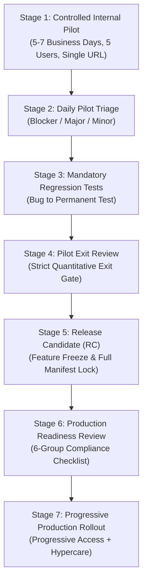
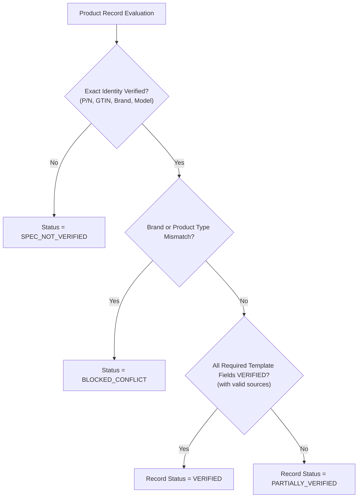

# Post-Pilot Governance & Field-Level Evidence Protocol

This document establishes the official operational standard for transitioning the Samsung Branch Operations Dashboard (Ayutthaya City Park) from **Internal Pilot** to **Production Readiness**.

---

## 1. Core Principle: Decoupling System Health from Field-Level Spec Accuracy

> [!IMPORTANT]
> A 100% passing test suite or clean deployment gate confirms **System Health and Stability**; it does **NOT** imply that all technical specifications for all products are verified.
>
> - **System Health**: Infrastructure, routing, authentication, F1 reconciliation, fail-closed guards, zero cross-product leakage, and UI responsiveness.
> - **Field-Level Spec Accuracy**: Each technical specification attribute (e.g. `maximumPower`, `ipRating`, `connectorA`) carries its own independent verification status, source citation, and evidence locator.

---

## 2. Seven-Stage Post-Pilot Lifecycle



### Stage 1: Controlled Internal Pilot
- **Participant Group**: 1 Store Leader + 4 Sales Staff (Ayutthaya City Park branch).
- **Target Duration**: 5 to 7 business days.
- **Production Status**: `PRODUCTION = HOLD`.
- **Target Domain**: Permanent Pilot URL only 👉 `https://samsung-stock-pilot.vercel.app` (random preview URLs strictly forbidden).
- **Issue Telemetry Schema**:
  Every logged issue must capture:
  `Reporter`, `View/Route`, `P/N or GTIN`, `Problem Type`, `Expected Result`, `Actual Result`, `Browser/OS`, `Timestamp`, `Deployment Commit`, `Screenshot / Screen Recording`.
- **Standard Issue Categories**:
  - `STOCK_COUNT` (Floor 1/Floor 2 inventory discrepancy)
  - `CATEGORY` (Misclassification in Cat1 -> Cat2 -> Cat3 hierarchy)
  - `COLOR` (Color normalization failure or unparsed variant)
  - `SPEC_IDENTITY` (Wrong model, brand, or product type matched)
  - `SPEC_FIELD` (Incorrect technical attribute value or missing evidence)
  - `PROMOTION` (Variant matching or bundle condition error)
  - `MEMBER_PERMISSION` (Role-based access control violation)
  - `ROUTE` (View isolation, navigation, or deep link failure)
  - `SESSION` (Session restore or authentication loss on reload)
  - `UI_LAYOUT` (Responsive breakdown, overflow, or visual glitch)
  - `PERFORMANCE` (Slow search, laggy drawer, or render delay)

### Stage 2: Daily Pilot Triage & Response Protocol
- **Blocker** (Immediate Pilot Halt & Hotfix SLA < 4h):
  - F1 stock reconciliation mismatch
  - Imported inventory data lost on refresh
  - Alias reverts to stale deployment commit
  - Unauthorized staff accessing Member Admin views
  - Cross-product specification leakage (e.g. phone specs on accessories)
  - Secret or credential exposure
- **Major** (Hotfix SLA < 24h):
  - Color normalization failure
  - Compatibility model list error
  - Incorrect product type assigned in Master
  - Verified field displayed without source citation
  - Search filter or sorting failure
  - Manual reload required after Excel import
- **Minor** (Scheduled Polish):
  - Text clarification, spacing, badge color, number formatting
- **Zero Blocker Rule**: `Blockers Open > 0` $\implies$ Production release blocked indefinitely.

### Stage 3: Mandatory Bug-to-Regression Test Cycle
> **RULE**: No bug is considered resolved until a permanent regression test is added to the test suite and passes in CI and Live Gate.
- Example: Soundcore item displaying phone specs $\implies$ UI test `accessory-spec-drawer.spec.ts` enforcing `BLUETOOTH_SPEAKER` and forbidden Galaxy A07 text.
- Example: `-Navy` displaying as unknown color $\implies$ `color-normalization.spec.ts`.
- Example: Legacy batch `IMPORT-20260906-002` re-appearing $\implies$ `batch-persistence.spec.ts`.

### Stage 4: Pilot Exit Review
Exit review must evaluate quantitative operational metrics:
- Active pilot sessions and total drawer views
- Zero open Blockers and zero open Major security issues
- `Stock F1 Reconciliation = PASS`
- `Import Persistence = PASS`
- `Route Isolation = PASS`
- `Cross-product Spec Leakage = 0`
- `Cross-brand Spec Leakage = 0`
- `Verified Fields without Source = 0`
- `Playwright Automated UI Suite = 100% PASS`
- `Live Runtime File Hashes = 100% MATCH`

### Stage 5: Release Candidate (RC) Freeze
- Formally tag the RC commit: `INTERNAL_PILOT = COMPLETED`, `RELEASE_CANDIDATE = READY_FOR_UAT`, `PRODUCTION = HOLD`.
- Absolute Feature Freeze: No new functionality permitted during RC validation.
- Rebuild dedicated package, lock runtime manifest, and run full static + live gates.

### Stage 6: Production Readiness Review (6 Compliance Dimensions)
1. **Stock Integrity**:
   - Summary cards: Floor 1 walk-in only (`F1_ONLY`).
   - Product table: Floor 1, Floor 2, and Arithmetic Total (`total = f1 + f2`).
   - Non-hardware suppression: SIM and Other categories permanently suppressed.
   - Excel Import Persistence: Validated across multiple session reloads.
2. **Access Control**:
   - Anonymous users blocked from protected routes.
   - Sales staff cannot access Member Admin view or API endpoints.
   - Admin API returns 401 without Bearer token and 403 for non-admin roles.
3. **Spec Safety**:
   - Zero default phone fallbacks.
   - Brand and Product Type mismatches blocked (`BLOCKED_CONFLICT`).
   - Unknown items fail closed (`SPEC_NOT_VERIFIED`).
   - 100% of `VERIFIED` and `VERIFIED_FROM_ERP` fields have validated source citations.
4. **Artifact Integrity**:
   - `pilot_runtime_manifest.json` schema validated via `Draft202012Validator`.
   - Live commit matches package build commit.
   - 100% of runtime file binary SHA-256 hashes match on live CDN.
   - Zero forbidden test/scratch files in runtime package.
5. **Operational Recovery**:
   - Rollback deployment procedure tested and verified.
   - Stock snapshot rollback tested.
   - Product Accessory Master database backed up.
   - Branch incident owner and on-call escalation established.
6. **Credential Safety**:
   - All runtime secrets confined strictly to Vercel environment variables.
   - Zero passwords, JWT tokens, or credentials in source code or reports.
   - Test accounts isolated from production identity pools.

### Stage 7: Progressive Production Rollout
- **Phase 1**: Store Leader access & validation.
- **Phase 2**: Branch Sales Staff rollout.
- **Phase 3**: Daily branch operations standard.
- **Hypercare Monitoring Cadence**: Check telemetry at 15 minutes, 1 hour, End of Day 1, Day 3, and Day 7.

---

## 3. Field-Level Evidence Specification (การตรวจหลักฐานรายฟิลด์)

### 3.1 Field Verification Statuses

| Status | Definition | Acceptance Requirement |
| :--- | :--- | :--- |
| `VERIFIED` | Field verified against manufacturer official documentation. | Exact identity match + Manufacturer official source + Exact model & variant + `sourceId` present. |
| `VERIFIED_FROM_ERP` | Field directly stated in internal ERP master / description. | Stated in ERP text (e.g. color "Black", length "1M", power "25W" in title). Note: Does **not** constitute manufacturer technical certification. |
| `PARTIALLY_VERIFIED` | Product has some verified fields, but others remain unconfirmed. | Used at record level or compound field level where evidence is incomplete. |
| `NOT_VERIFIED` | Attribute value has no verified source documentation. | Display placeholder or cautionary text (e.g. "ยังไม่ได้ยืนยัน - ตรวจสอบตามเอกสาร"). |
| `AI_SUGGESTED_REVIEW_REQUIRED`| Suggested by LLM/AI parser but awaiting human/official confirmation. | E.g. Description says "TG" and AI suggests "TEMPERED_GLASS". Must be verified before promotion. |
| `BLOCKED_CONFLICT` | Contradiction between stock ERP record and reference source. | E.g. Brand mismatch (Soundcore vs. Samsung) or Product Type mismatch (Speaker vs. Phone). |

### 3.2 Hierarchy of Evidence Sources

```
1. Manufacturer Official Product Website (e.g. soundcore.com, samsung.com)
   ├── 2. Manufacturer Support Page / Technical Knowledge Base
   ├── 3. Manufacturer Official User Manual / Technical Datasheet (PDF)
   ├── 4. Approved National Distributor Master (e.g. SIS, Synnex)
   ├── 5. Internal ERP Stock Master / Procurement Invoices
   ├── 6. Retail Box Packaging / Printed Thailand Warranty Cards
   ├── 7. Authorized E-Commerce Retailer Pages (Supporting reference only)
   └── 8. AI / LLM Extraction (Advisory suggestion only; cannot auto-verify)
```

### 3.3 Structure of an Evidence-Backed Field

```json
{
  "maximumPower": {
    "value": 100,
    "unit": "W",
    "displayValue": "สูงสุด 100W",
    "status": "VERIFIED",
    "sourceId": "SRC-ADAM-ILINIO-OFFICIAL",
    "evidenceLocator": "Specifications > Charging Power > Max 100W",
    "checkedAt": "2026-09-16",
    "checkedBy": "SYSTEM_REVIEW"
  }
}
```

### 3.4 Structure of a Source Record

```json
{
  "sourceId": "SRC-ADAM-ILINIO-OFFICIAL",
  "sourceType": "MANUFACTURER_OFFICIAL",
  "publisher": "ADAM elements",
  "url": "https://www.adamelements.com/products/ilinio-c2c-100w",
  "documentTitle": "iLinio USB-C to USB-C 100W Cable Specifications",
  "marketRegion": "TH",
  "language": "en",
  "retrievedAt": "2026-09-16T04:30:00Z",
  "contentHash": "e3b0c44298fc1c149afbf4c8996fb92427ae41e4649b934ca495991b7852b855",
  "status": "ACTIVE"
}
```

### 3.5 Rules for Elevating Product Record Status



- **`VERIFIED`**: Requires Exact Identity + **100% of Required Template Fields** verified with active sources + zero conflicts.
- **`PARTIALLY_VERIFIED`**: Exact Identity verified + at least one field verified, but some required or optional fields remain `NOT_VERIFIED`.
- **`SPEC_NOT_VERIFIED`**: Exact Identity not found in Master (safe fail-closed).
- **`BLOCKED_CONFLICT`**: Brand mismatch, type mismatch, or contradictory source data.

### 3.6 Automated Integrity Rules Enforced in CI & Live Gates

The following rules are executed automatically by `verify_live_manifest.py` and `ci_quality_gate.py`:
1. Every field with status `VERIFIED` or `VERIFIED_FROM_ERP` **MUST** specify a non-empty `sourceId`.
2. The referenced `sourceId` **MUST** exist in the record's `sources` array.
3. Every source `url` must use the `https://` protocol.
4. Source `brand` and `productType` must match the product's identity.
5. Golden fixtures must never lose verified attributes across releases.
6. Fallback to smartphone profiles is strictly forbidden across all accessory product types.
