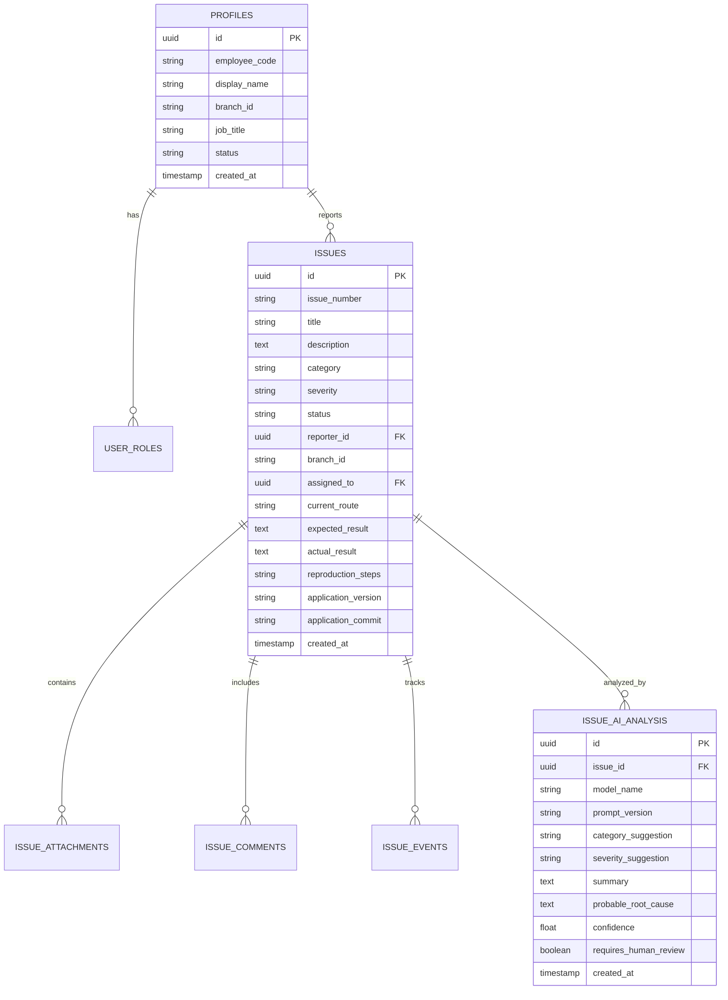

# 🚀 สถาปัตยกรรมระบบระยะทดลองจริง (Phase B: User Feedback Pilot & Supabase Integration)

## 📌 บทนำและเป้าหมายเชิงกลยุทธ์
เปลี่ยนผ่านระบบจาก **“Dashboard สำหรับดูข้อมูล (Static Read-Only Preview)”** เข้าสู่ **“ระบบทดลองใช้งานจริงระดับสาขาแบบมีวงจรสะท้อนกลับ (Live Feedback Pilot System)”** 
โดยเปิดให้พนักงานประจำสาขารายงานปัญหาจริงเข้าสู่ฐานข้อมูลส่วนกลาง, ผู้ดูแลระบบติดตามและมอบหมายงาน, และมีระบบ AI ช่วยจัดหมวดหมู่ วิเคราะห์สาเหตุรากเหง้า (Root Cause) และเสนอจุดที่ควรปรับปรุงอย่างปลอดภัย

---

## 🔒 1. การบริหารจัดการ Code Freeze และ Branch Strategy

เพื่อให้มั่นใจว่า **Release Candidate Baseline เดิมจะไม่ได้รับผลกระทบใดๆ**:
1. **Baseline Freeze**:
   - `CURRENT_PREVIEW_BASELINE = FROZEN` (ล็อกไว้ที่ Commit `a7c3390` / `c04d405`)
   - Production Runtime 23 ไฟล์ (`index.html`, `app.js`, `stock_data.js`, ฯลฯ) ปลอดภัย 100%
2. **Branch ใหม่สำหรับ Phase B**:
   - สร้าง Branch: `feature/user-feedback-pilot`
   - แตกกิ่งออกจาก `feature/phase-a-application-shell`
   - พัฒนาระบบ Authentication, Supabase Client, และ Issue Tracking บน Branch ใหม่นี้โดยเฉพาะ

```
[Main / Preview Candidate] ─── (Code Freeze: a7c3390) ─── [Stable Baseline]
                                       │
                                       └───► [Branch: feature/user-feedback-pilot]
                                                  ├── Phase 1: Supabase Auth & Dual Roles
                                                  ├── Phase 2: Central Issue Reporting
                                                  ├── Phase 3: Server-side AI Triage
                                                  └── Phase 4: Executive Pilot Dashboard
```

---

## 👥 2. โครงสร้างสิทธิ์และ Dual-Role ของท่าน (Store Leader + System Admin)

ท่านดำรงตำแหน่ง 2 บทบาทควบคู่กันอย่างสมบูรณ์แบบ:
- **Scope สาขา**: `AYUTTHAYA_CITY_PARK`
- **Scope ระบบ**: `BRANCH_OPERATIONS_PILOT`
- **Roles**: `STORE_LEADER` + `SYSTEM_ADMIN`

### ระบบสลับโหมดบนหน้าจอ (Dual-Mode Interface):
1. 🏪 **โหมดผู้จัดการสาขา (Store Leader Mode)**:
   - ตรวจดูสต็อก, โปรโมชั่น, ราคาหน้าร้าน
   - ตรวจสอบและยืนยันปัญหาที่พนักงานในสาขารายงาน (`VERIFIED`)
   - มอบหมายงานให้พนักงาน และตรวจทาน Exact P/N
   - ดูรายงานสรุป AI Weekly Digest ประจำสาขา
2. ⚙️ **โหมดดูแลระบบ (System Admin Mode)**:
   - จัดการสมาชิกและสิทธิ์ผู้ใช้ (เชิญ, กำหนด Role, ระงับบัญชี)
   - ควบคุมคิว AI Analysis และตั้งค่า Prompt Version
   - ตรวจสอบ Audit Trail และ System Health Logs
   - บังคับ Logout ทุกอุปกรณ์ และกำหนด Retention Policy

### กฎความปลอดภัย (Sensitive Action Re-authentication):
แม้อยู่ใน Session 30 วัน หากทำธุรกรรมสำคัญต่อไปนี้ **ระบบจะบังคับใส่รหัสผ่านใหม่ (Re-auth)**:
- เปลี่ยน Role หรือระงับสมาชิก
- Publish Promotion หรือยืนยัน Stock Snapshot ส่วนกลาง
- ลบ Issue หรือ Export ข้อมูลทั้งระบบ
- เปลี่ยนการตั้งค่า AI Configuration

---

## 🗄️ 3. โครงสร้างฐานข้อมูล Supabase PostgreSQL & RLS Policies



### นโยบาย Row Level Security (RLS) ที่เข้มงวด:
- **`MEMBER`**:
  - `SELECT`: เฉพาะ Issue ที่ตนเองเป็นผู้รายงาน (`reporter_id = auth.uid()`)
  - `INSERT`: สร้าง Issue ใหม่ได้ในสถานะ `NEW` เท่านั้น
  - `UPDATE`: แก้ไขได้เฉพาะก่อนสถานะเปลี่ยนเป็น `TRIAGED`
- **`STORE_LEADER`**:
  - `SELECT`: ดู Issue ทั้งหมดภายใน `branch_id` เดียวกัน
  - `UPDATE`: ปรับ Severity, มอบหมายงาน, เปลี่ยนสถานะเป็น `VERIFIED`
- **`SUPPORT`**:
  - `SELECT`: ดู Issue ที่ได้รับมอบหมายหรือเกี่ยวข้องกับระบบ
  - `UPDATE`: เปลี่ยนสถานะเป็น `IN_PROGRESS`, `FIX_READY`, เพิ่ม Root Cause
- **`SYSTEM_ADMIN`**:
  - `ALL`: สิทธิ์เต็มรูปแบบทุกสาขา พร้อม Audit Log บันทึกทุก Action

---

## ⏱️ 4. สถาปัตยกรรม Session 30 วัน (Time-Boxed Long Session)

| พารามิเตอร์ | ค่าที่กำหนด | เหตุผลทางความปลอดภัย |
| :--- | :--- | :--- |
| **Access Token Lifetime** | 1 ชั่วโมง (60 นาที) | สั้น ป้องกันการขโมย Token ค้างในเครือข่าย |
| **Refresh Token Rotation** | เปิดใช้งาน (Enabled) | Token ถูกหมุนใหม่ทุกครั้งที่ Refresh ป้องกัน Replay Attack |
| **Maximum Session Lifetime** | 30 วัน | พนักงานไม่ต้อง Login ซ้ำทุกวัน สะดวกสำหรับอุปกรณ์หน้าร้าน |
| **Inactivity Timeout** | 14 วัน | หากไม่มีการเปิดใช้งานนานเกิน 2 สัปดาห์ ระบบจะตัด Session ทันที |
| **Re-auth on Sensitive Action** | บังคับใช้ (Enforced) | ป้องกันบุคคลอื่นกดสิทธิ์หรือลบข้อมูลขณะเครื่องหน้าร้านเปิดทิ้งไว้ |

---

## 🤖 5. กลไก AI Analysis Pipeline (Server-side Only)

```
พนักงานรายงานปัญหา (Client)
         │
         ▼
[Vercel Serverless Function: /api/issues/create]
         │ (ตรวจ Authorization + ทำ Data Redaction ลบ Password/Token/ข้อมูลลูกค้า)
         ▼
[Supabase PostgreSQL (Status: NEW)]
         │
         ▼
[Serverless Background Queue: /api/issues/ai-triage]
         │ (ส่ง Prompt ไปยัง Claude 3.5 Sonnet / Gemini API)
         ▼
[AI Analysis Result บันทึกลงตาราง issue_ai_analysis]
         │
         ▼
[ผู้ดูแลระบบ / Store Leader ตรวจสอบและกดยืนยันผล]
```

### กฎเหล็กของ AI (Safety Guardrails):
- ❌ AI **ห้าม** แก้ไขสถานะเป็น `RESOLVED` หรือ `CLOSED` เองโดยเด็ดขาด
- ❌ AI **ห้าม** ลบ Issue หรือเปลี่ยนแปลง Role/Permission ของผู้ใช้
- ❌ AI **ห้าม** แก้ไขราคา, สต็อก, หรือโปรโมชั่น
- ✅ AI ทำหน้าที่เป็น **“ผู้ช่วยวิเคราะห์ (Assistant)”** สรุปปัญหา, แนะนำ Category, ตรวจจับปัญหาที่เกิดซ้ำ (Duplicates), และจัดทำ Weekly Digest ให้ผู้จัดการสาขา
