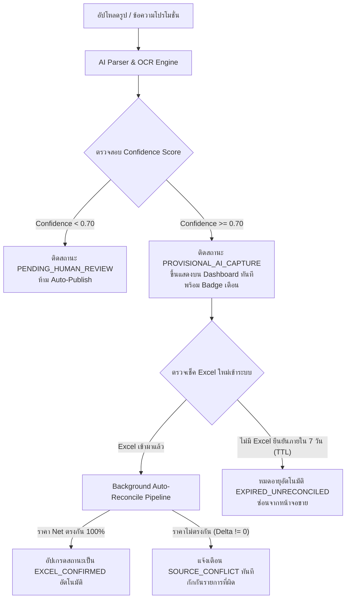

# สัญญาและข้อกำหนดสถาปัตยกรรม: AI Promotion Ingestion & Dual-Path Safety Net (Phase 4)

เอกสารนี้กำหนดข้อกำหนดทางเทคนิค สัญญา Data Schema และกลไกความปลอดภัยสองเส้นทาง (Dual-Path Safety Net Architecture) สำหรับการนำเข้าข้อมูลโปรโมชั่นจากภาพถ่ายป้ายหน้าร้านและข้อความประกาศ (Image / Text Flyer) ด้วยระบบปัญญาประดิษฐ์ (AI Engine) โดยไม่ต้องมีมนุษย์กดยืนยันทีละรายการ แต่คงความถูกต้องของราคาและสมการอย่างเข้มงวด

---

## 1. ปรัชญาการออกแบบ (Design Principles)
1. **ไม่บล็อกความเร็วหน้าร้าน**: ข้อมูลโปรโมชั่นจากสำนักงานใหญ่ (HQ) ต้องสามารถขึ้นจออ้างอิงราคาได้ทันที
2. **แยกความเสี่ยงตามธรรมชาติของข้อมูล (Dual-Path Segregation)**:
   - **เส้นทาง A (ข้อมูลเสริม ไม่แตะราคา)**: ไหลเข้าสู่ระบบทันทีแบบ 100% Zero-Touch
   - **เส้นทาง B (โปรโมชั่นใหม่พร้อมราคา)**: ไหลขึ้นหน้าจอทันที แต่ติดป้ายกำกับชั่วคราว (`PROVISIONAL_AI_CAPTURE`) และมีระบบตรวจสอบย้อนหลังอัตโนมัติ (Background Auto-Reconciliation)
3. **ความปลอดภัยย้ายไปอยู่หลังบ้าน**: ไม่ใช้คนเป็นคอขวด แต่ใช้ Excel Pipeline + Rule Engine ที่เสถียรแล้วเป็นตาข่ายนิรภัยตรวจสอบย้อนหลัง

---

## 2. เส้นทาง A: ข้อมูลเสริม/ของแถม (Supplemental Non-Pricing Attributes)

### 2.1 ขอบเขตการทำงาน
ใช้สำหรับรูปภาพหรือข้อความที่เป็นการประกาศของแถมเพิ่มเติม เงื่อนไขเฉพาะสาขา หรือรายละเอียดบัตรเครดิตที่เครื่องหลักมีราคาและโปรโมชั่นยืนยันอยู่ใน Excel อยู่แล้ว

### 2.2 กฎการประมวลผล
- AI สกัดข้อมูลและจับคู่กับ `promoId` หรือ `(model, capacity, effectiveDate)` ที่มีสถานะ `EXCEL_CONFIRMED`
- เขียนทับเฉพาะฟิลด์เสริม:
  - `additionalConditionsFromAI`: รายการเงื่อนไขเพิ่มเติม
  - `freebieNoteFromAI`: ข้อความของแถมที่ได้รับเสริม
- **ไม่แก้ไขฟิลด์ราคาใดๆ ทั้งสิ้น**: `rrp`, `netPrice`, `discountValue`, `standardDiscount`, `addOnDiscount`, `ssDiscount`, `cpwDiscount` จะคงเดิม 100%
- **ระดับการเผยแพร่**: **Auto-Publish ทันที** โดยไม่ต้องรอการอนุมัติ

---

## 3. เส้นทาง B: โปรโมชั่นใหม่พร้อมราคา (Provisional Pricing Promotion)

### 3.1 ขอบเขตการทำงาน
ใช้สำหรับโปรโมชั่นใหม่ที่สำนักงานใหญ่ส่งภาพประกาศหรือข้อความมาก่อนที่ไฟล์ Excel ทางการจะมาถึง

### 3.2 ตาข่ายนิรภัย 3 ชั้น (Triple Safety Net)



#### ชั้นที่ 1: เกณฑ์ความมั่นใจ & การขึ้นจอทันที (Confidence Gate & Provisional Badge)
- **`aiConfidenceScore >= 0.70`**: ขึ้นแสดงบน Dashboard ทันที โดยติดสถานะ `PROVISIONAL_AI_CAPTURE` พร้อม Badge สีส้ม `"โปรชั่วคราว (รอ Excel ยืนยัน)"`
- **`aiConfidenceScore < 0.70`**: หากภาพเบลอ ตัวเลขไม่ชัดเจน หรือข้อความกำกวม ระบบจะส่งเข้าคิว `PENDING_HUMAN_REVIEW` ไม่อนุญาตให้ขึ้น Dashboard อัตโนมัติ

#### ชั้นที่ 2: การกระทบยอดอัตโนมัติเมื่อ Excel เข้ามา (Background Auto-Reconciliation)
เมื่อไฟล์ Excel รอบถัดไปถูกนำเข้าสู่ระบบผ่าน `audit_engine.py`:
- ระบบจะค้นหาโปรโมชั่นชั่วคราว (`PROVISIONAL_AI_CAPTURE`) ที่ตรงกับ Model และ Date Range
- **กรณีราคาตรงกัน ($Net_{Excel} = Net_{AI}$)**:
  - ปรับสถานะเป็น `EXCEL_CONFIRMED`
  - บันทึก `reconciledAgainstBatchId = excelBatchId`
- **กรณีราคาไม่ตรงกัน ($Net_{Excel} \ne Net_{AI}$)**:
  - ติดรหัสข้อผิดพลาด `SOURCE_CONFLICT`
  - บันทึกประวัติ `reconciliationDelta` (ส่วนต่างราคาเป็นบาท)
  - แจ้งเตือนผู้จัดการสาขาเพื่อตรวจสอบยอดขายย้อนหลัง

#### ชั้นที่ 3: ระบบหมดอายุอัตโนมัติ (Time-To-Live / TTL Expiration)
- กำหนด TTL สูงสุด **7 วัน (168 ชั่วโมง)** นับจากเวลาที่ AI สร้าง Record (`aiCapturedAt`)
- หากล่วงเลยเวลา TTL แล้วยังไม่มีไฟล์ Excel เข้ามายืนยัน ระบบจะปรับสถานะเป็น `EXPIRED_UNRECONCILED` และซ่อนโปรโมชั่นนี้ออกจากหน้าแคชเชียร์โดยอัตโนมัติ เพื่อป้องกันราคาที่ไม่มีที่มารั่วไหลค้างในระบบ

---

## 4. Data Model Schema Specification

```typescript
export interface PromotionVariant {
  // --- Standard Core Identity ---
  promoId: string;
  model: string;
  capacity: string;
  productCodeType: "STANDARD_SM" | "PASS_F" | "STANDARD_ACCESSORY" | "BOM_SET";
  saleMode: "STANDARD_PAYMENT" | "ADD_ON_PURCHASE" | "TRADE_UP" | "SF_PLUS" | "STUDENT";
  
  // --- Price & Discount Engine ---
  rrp: number;
  netPrice: number;
  discountValue: number;
  addOnDiscount?: number;
  ssDiscount?: number;
  cpwDiscount?: number;

  // --- Phase 4 AI Ingestion & Provenance Extensions ---
  promotionSourceType: "EXCEL_CONFIRMED" | "PROVISIONAL_AI_CAPTURE" | "MANUAL_BRANCH_OVERRIDE";
  
  // Path A: Supplemental attributes
  additionalConditionsFromAI?: string[];
  freebieNoteFromAI?: string;

  // Path B: Provisional AI Capture
  provisionalStatus?: "ACTIVE_PROVISIONAL" | "AUTO_RECONCILED" | "SOURCE_CONFLICT" | "EXPIRED_UNRECONCILED" | "PENDING_HUMAN_REVIEW";
  aiConfidenceScore?: number;           // 0.00 - 1.00 (Threshold >= 0.70 required for Auto-Publish)
  aiCapturedAt?: string;                // ISO 8601 Timestamp
  ttlExpiresAt?: string;                // ISO 8601 Timestamp (CapturedAt + 7 days)
  
  // Media Provenance Integrity
  rawSourceMediaRef?: string;           // File path or URI of original image/text
  rawSourceMediaSha256?: string;        // SHA-256 checksum of raw uploaded flyer media
  
  // Background Auto-Reconciliation Telemetry
  reconciledAgainstBatchId?: string;    // Synchronized Excel Import Batch ID
  reconciliationDelta?: {
    priceMatched: boolean;
    excelNetPrice: number;
    aiCapturedNetPrice: number;
    differenceBaht: number;
    reconciledAt: string;
  };
}
```

---

## 5. การส่งต่อสู่ Phase 3 & 4 Implementation
- **Phase 2 (ปัจจุบัน)**: หน้าอัปโหลดสต็อกพร้อม Diff Table และ Export/Import JSON Sync Bridge เสร็จสมบูรณ์
- **Phase 3 (ถัดไป)**: หน้าอัปโหลดโปรโมชั่นผ่าน Excel พร้อมตรวจเช็คสถานะ `PASSED / WARNING / BLOCKED`
- **Phase 4**: เชื่อมต่อ AI OCR Engine และเปิดใช้งาน Dual-Path Safety Net ตามสัญญาข้อตกลงนี้ 100%
