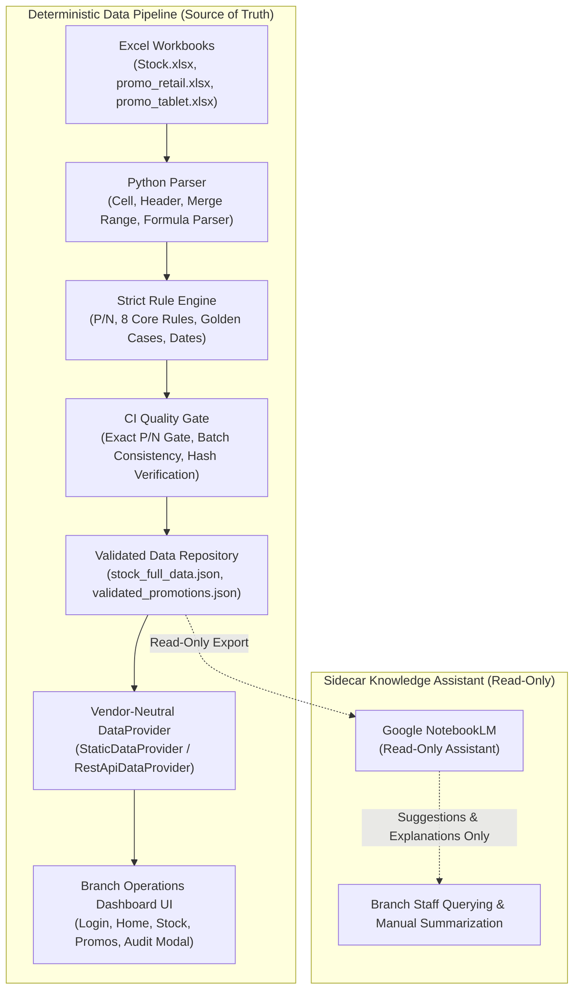

# Architecture Decision Record (ADR): System Architecture Direction & Decoupling

> **Decision Status**: `CONFIRMED` (Option 1: Independent Team Architecture with Read-Only NotebookLM)  
> **Date**: `2026-09-07`  
> **Git Branch**: `feature/phase-a-application-shell`  
> **Supersedes**: Prior Enterprise Azure / Entra ID Architecture Proposals

---

## 1. Context & Motivation

Initial planning explored enterprise integration using Microsoft Entra ID (Azure AD), Azure Functions, and Azure Application Insights. Subsequent governance reviews revealed that corporate tenant approvals, enterprise app registrations, and resource group provisioning introduce external dependencies that do not match the operational autonomy needed for internal branch tooling.

Furthermore, exploring LLM capabilities (specifically Google NotebookLM) created potential confusion about whether AI models could be used to directly parse spreadsheets or update prices on the dashboard.

This ADR establishes the **authoritative architectural direction** for the Samsung Branch Operations System.

---

## 2. Core Architectural Decisions

### Decision 1: NotebookLM Strictly a Read-Only Knowledge Assistant
- **NotebookLM is NOT an ETL pipeline.** It does not parse raw Excel workbooks for production pricing.
- **NotebookLM has zero write access.** It cannot write to databases, update prices, change coupons, toggle sale modes, unblock quarantined variants, calculate replacement prices, or publish to the dashboard.
- Any insight, contradiction, or discrepancy identified by NotebookLM is classified strictly as `SUGGESTION`, `NEEDS_REVIEW`, or `SOURCE_CONFLICT`. It cannot alter validation status.

### Decision 2: Complete Decoupling from Corporate Azure & Entra ID
- Removed all hardcoded assumptions of Microsoft Entra ID, Azure Functions, Azure Tenant IDs, and Azure Application Insights.
- Abstracted the architecture into **vendor-neutral service interfaces** (`DataProvider`, `AuthProvider`, `MonitoringAdapter`).
- Retained standard HTTP conventions (`Authorization: Bearer <token>`, `X-Branch-Code`) without binding to any specific cloud vendor.

### Decision 3: Vendor-Neutral Service Abstractions
1. **DataProvider**:
   - `StaticDataProvider`: Active in Phase A & B. Zero backend dependencies.
   - `RestApiDataProvider`: Standard REST API client.
   - `SupabaseDataProvider`: `NOT_CONFIGURED` (reserved for future independent backend evaluation).
   - `FutureDataProvider`: `NOT_CONFIGURED`.
2. **AuthProvider**:
   - `DevelopmentAuthProvider`: Active in Phase A & B (Session UI gate via `sessionStorage`).
   - `PasswordlessAuthProvider` / `SupabaseAuthProvider`: `NOT_CONFIGURED`.
3. **MonitoringAdapter**:
   - `ConsoleMonitoring`: Active in Phase A & B with **mandatory log redaction**.
   - `SupabaseMonitoring` / `SentryMonitoring`: `NOT_CONFIGURED`.

### Decision 4: Phase C Redefined as Independent Backend Foundation
- Phase C is renamed from `Phase C: Entra ID + Azure Backend` to **`Phase C: Independent Backend Foundation`**.
- Phase C remains on **HOLD** until Phase A.1 and Phase B are fully closed and approved.
