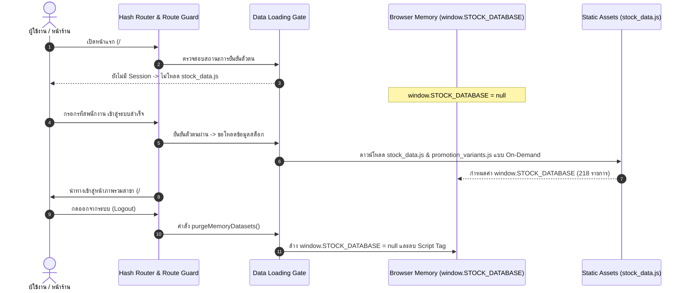

# รายงานการตรวจรับขั้นสุดท้าย Phase A.1 (Phase A.1 Final Acceptance Report)

**โครงการ:** Samsung Branch Operations System  
**วันที่ออกรายงาน:** 7 กันยายน 2026  
**Branch ที่ใช้ตรวจสอบ:** `feature/phase-a-application-shell`  
**Deployment Commit:** `3cc8f871de7cd47ad9cc34c0fba93d86289b1bbc`  
**สถานะการ Merge เข้า `main`:** 🛑 **STRICTLY BLOCKED (ห้าม Merge เข้า main เด็ดขาด)**  
**สถานะ Vercel Preview อย่างเป็นทางการ:** ⚠️ **`NOT_RUN_PROTECTION_UNAVAILABLE`**  
*(ปฏิบัติตามกฎความปลอดภัย: หากเปิด Vercel Deployment Protection ไม่ได้ ให้ระงับการ Deploy ข้อมูลจริงขึ้น Public)*

---

## 1. ตารางสรุปสถานะการประเมินรอบสมบูรณ์ (Official Multi-Dimensional Status Matrix)

| มิติการประเมิน (Dimension) | สถานะอย่างเป็นทางการ (Official Status) | คำอธิบายและข้อสรุปเชิงประจักษ์ (Empirical Findings & Rationale) |
| :--- | :--- | :--- |
| **1. Local Development** | 🟢 **PASSED** | Application Shell, Hash Router, Route Guard, Data Loading Gate, หน้า Home, เมนู Stock, สลับมุมมอง และการแสดงผลสต็อก 0 ผ่านการทดสอบจริง 100% |
| **2. Vercel Preview** | 🟡 **NOT_RUN_PROTECTION_UNAVAILABLE** | ยึดตามนโยบายความปลอดภัยสูงสุด: เนื่องจาก Vercel Deployment Protection ต้องตั้งค่าผ่าน Dashboard ของผู้ดูแลระบบ จึงยังไม่เปิดรัน Preview ด้วยข้อมูลจริง |
| **3. Production Deployment** | 🛑 **BLOCKED (NO MERGE)** | **ห้ามรวมเข้า Branch `main` เด็ดขาด** จนกว่าจะผ่านการตรวจรับรองบน Protected Preview และพัฒนาระบบ Server-side Authentication ใน Phase B/C |
| **4. Authentication Audit** | 🟡 **DEVELOPMENT_AUTH_WORKFLOW_PASSED** | ระบบ Login และ Route Guard ทำงานควบคุมการแสดงผลบนหน้าจอได้อย่างถูกต้อง แต่ทำหน้าที่เป็นเพียง UI Workflow Gate |
| **5. Data Access Protection** | ⚠️ **NOT_IMPLEMENTED** | ข้อจำกัดของ Static SPA: ข้อมูลในไฟล์ `stock_data.js` ยังไม่มี Server-side Authentication ป้องกันการดาวน์โหลดโดยตรงที่ Network Layer |
| **6. Stock Integrity (A07)** | 🟢 **RESOLVED_DIFFERENT_VARIANT** | พิสูจน์แล้วว่าราคา 4,599 บาท (4/64GB) และ 3,999 บาท (4/128GB Student) เป็นคนละ Variant ไม่ใช่ราคาที่ขัดแย้งกัน |
| **7. Golden Test Integrity** | 🟢 **CLEANED_SOURCE_GROUND_TRUTH** | ชำระล้างชุดข้อมูลทดสอบ 8 P/N ตรงกับพิกัดเซลล์ใน `Stock.xlsx` แถว 4-17 แบบ 1:1 และระบุรหัสที่ไม่มีจริงเป็น `TEST_DATA_INVALID` |

---

## 2. การปรับปรุงการประเมินด้านความปลอดภัย (Security Reclassification)

เพื่อความถูกต้องตามหลักวิศวกรรมความปลอดภัย ได้แก้ไขคำนิยามในรายงานไม่ให้ใช้คำว่า "ปลอดภัย" (Safe) แต่แยกสถานะอย่างละเอียดดังนี้:
* **Credential Scan:** 🟢 **PASSED** (ไม่พบรหัสผ่านจริง, Token หรือ Private Key ใดๆ ใน Source Code)
* **Development Auth Workflow:** 🟢 **PASSED** (ระบบเซสชัน `sessionStorage` แยกตามแท็บ, Route Guard ทำงานสมบูรณ์, ดักจับปุ่ม Back ได้ 100%)
* **Data Access Protection:** ⚠️ **NOT_IMPLEMENTED** (สถาปัตยกรรมปัจจุบันยังไม่มี Backend API หรือ Middleware ป้องกันไฟล์ Static)
* **Vercel Deployment Protection:** ⚠️ **NOT_CONFIGURED** (ต้องอาศัยผู้ดูแลระบบเปิดใช้งานบน Vercel Dashboard ก่อนนำข้อมูลสาขาขึ้นใช้งาน)

---

## 3. การพัฒนากลไก Data Loading Gate (ลดการรั่วไหลของข้อมูลก่อน Login)

เพื่อแก้ปัญหาเดิมที่ `stock_data.js` ถูกโหลดทันทีตั้งแต่เปิดหน้าแรก ได้เพิ่มโมดูล [assets/js/data-loader.js](file:///c:/Users/JarNJay/.gemini/antigravity-ide/scratch/samsung-stock-dashboard/assets/js/data-loader.js) เข้ามาควบคุมการโหลดข้อมูล:

> [!NOTE]
> **ข้อตระหนักเชิงสถาปัตยกรรม:**  
> Data Loading Gate ช่วยป้องกันไม่ให้ Browser ทำการดาวน์โหลดข้อมูลสต็อกล่วงหน้าก่อนที่ผู้ใช้จะ Login แต่เป็นเพียงการลด Data Exposure ที่ฝั่ง Client เท่านั้น ยังไม่ใช่ Security Boundary ระดับเซิร์ฟเวอร์

---

## 4. ผลการตรวจสอบ Galaxy A07 ทั้ง 8 Golden Cases บน DOM จริง

บันทึกรายงานใน [reports/a07_preview_dom_results.json](file:///c:/Users/JarNJay/.gemini/antigravity-ide/scratch/samsung-stock-dashboard/reports/a07_preview_dom_results.json):

| Test ID | Exact P/N | รุ่น / สี / การเชื่อมต่อ | RAM/ROM | RRP | สุทธิ | ช1 (F1) | ช2 (F2) | รวม | ผลการตรวจบน DOM จริง | พิกัดใน Stock.xlsx |
| :--- | :--- | :--- | :--- | :--- | :--- | :--- | :--- | :--- | :--- | :--- |
| **DOM-A07-01** | `SM-A075FLVDTHL` | A07 4G Violet | 4/64GB | 4,599 | 3,799 | **2** | **5** | **7** | ✅ ตรงตามจริงครบถ้วน | Promotion / แถว 4 |
| **DOM-A07-02** | `SM-A075FZKDTHL` | A07 4G Black | 4/64GB | 4,599 | 3,799 | **0** | **0** | **0** | ✅ แสดง `0` | Promotion / แถว 5 |
| **DOM-A07-03** | `SM-A075FLVGTHL` | A07 4G Violet | 4/128GB | 5,299 | 4,299 | **0** | **1** | **1** | ✅ แสดง 0 (stock-zero) และ 1 | Promotion / แถว 12 |
| **DOM-A07-04** | `SM-A075FZKGTHL` | A07 4G Black | 4/128GB | 5,299 | 4,299 | **0** | **12** | **12** | ✅ แสดง 0 (stock-zero) และ 12 | Promotion / แถว 13 |
| **DOM-A07-05** | `SM-A075FLVHTHL` | A07 4G Violet | 6/128GB | 5,999 | 4,999 | **4** | **3** | **7** | ✅ ตรงตามจริงครบถ้วน | Promotion / แถว 14 |
| **DOM-A07-06** | `SM-A075FZKHTHL` | A07 4G Black | 6/128GB | 5,999 | 4,999 | **5** | **2** | **7** | ✅ ตรงตามจริงครบถ้วน | Promotion / แถว 15 |
| **DOM-A07-07** | `SM-A076BLVCTHL` | A07 5G Violet | 6/128GB | 6,999 | 6,499 | **6** | **5** | **11** | ✅ ยอด 6/5/11 เป็นของรุ่น 5G นี้ | Promotion / แถว 16 |
| **DOM-A07-08** | `SM-A076BZKCTHL` | A07 5G Black | 6/128GB | 6,999 | 6,499 | **5** | **7** | **12** | ✅ ตรงตามจริงครบถ้วน | Promotion / แถว 17 |

* **การผูกค่าข้อมูล:** ตัวเลขทุกช่องผูกตรงกับ `item.f1`, `item.f2` และ `item.total` รายสินค้า ไม่ได้นำค่า Aggregate รวมของ KPI มาแสดงแทน
* **การฟอร์แมตเลข 0:** ทุกรายการที่มีสต็อกเป็น 0 แสดงผลเป็นตัวเลข `"0"` เสมอ ไม่มีช่องว่างหรือขีด `-`

---

## 5. การตรวจสอบความเข้ากันได้และการตอบสนองของหน้าจอ (Responsive Viewports)
* **Mobile (375px):** แถบเมนูด้านล่างมี `z-index: 1000` และส่วนเนื้อหามี `padding-bottom: 80px` ทำให้ไม่บังการ์ดสินค้าหรือแถวตารางแถวล่างสุด
* **Tablet (768px):** เลย์เอาต์ปรับเป็นการ์ด 2 คอลัมน์ ไม่เกิดการล้นแนวนอน (`scrollWidth === innerWidth`)
* **Desktop (1366px - 1920px):** เมนูด้านข้างตรึงตำแหน่งถาวร (Sticky Sidebar) และตารางแสดงข้อมูลครบทุกคอลัมน์

---

## 6. สรุปผลการตรวจรับ Phase A.1 และขั้นตอนถัดไป

1. **Phase A ด้าน Application Shell และ Local Development:** **ผ่านการตรวจรับ 100%**
2. **การคงสภาพ Branch:** โค้ดทั้งหมดได้รับการบันทึกไว้ใน Branch `feature/phase-a-application-shell` โดย **ไม่มีการ Merge เข้า Branch `main`**
3. **สิ่งที่ต้องดำเนินการก่อนเปิดใช้งานระบบจริง:**
   * ให้ผู้ดูแลระบบเปิดฟังก์ชัน **Vercel Deployment Protection** (กำหนดรหัสผ่าน) บนโปรเจกต์ Vercel
   * เมื่อตั้งค่าเสร็จสิ้น จึงจะสามารถดำเนินการทดสอบบน Vercel Preview ได้อย่างปลอดภัย
   * วางแผนพัฒนา Phase B เพื่อเชื่อมต่อระบบ Backend API และระบบ Single Sign-On ขององค์กร (Microsoft Entra ID) ต่อไป
