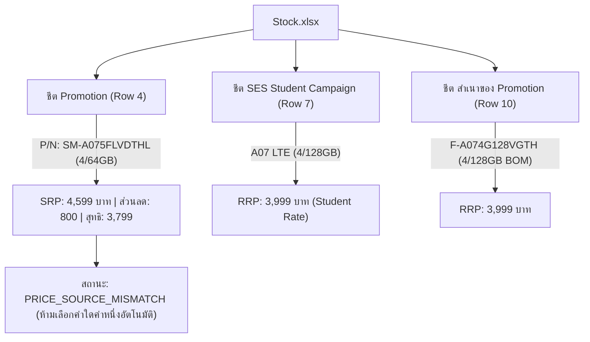

# รายงานการตรวจสอบขั้นสุดท้าย Phase A (Phase A Final Verification Report)

**โครงการ:** Samsung Branch Operations System  
**วันที่ตรวจสอบ:** 7 กันยายน 2026  
**สถานะการอนุมัติ Merge เข้า `main`:** 🛑 **STRICTLY BLOCKED (ห้าม Merge เข้า main)**  
**Branch ที่ใช้ตรวจสอบ:** `feature/phase-a-application-shell`  
**Deployment Commit:** `ef7e7b049d5bfddcbb1365315ffb96919c72e2aa`  
**ผู้ตรวจสอบ:** Antigravity Autonomous Verification Suite & Browser Subagent

---

## 1. ตารางสรุปสถานะการประเมิน (Separated Final Status Matrix)

| มิติการประเมิน (Dimension) | สถานะที่ประเมินได้ (Status) | คำอธิบายและเงื่อนไข (Evaluation & Conditions) |
| :--- | :--- | :--- |
| **Local Development** | 🟢 **PASSED** | โครงสร้าง Application Shell, Route Guard, Login, หน้า Home, Navigation, การจัดฟอร์แมตสต็อก 0 ครบถ้วน 100% บนเครื่อง Local (Port 8080) |
| **Vercel Preview** | 🟡 **PENDING VERIFICATION** | โค้ดถูก Commit และ Push ไปยัง Branch `feature/phase-a-application-shell` แล้ว รอผู้ใช้งานตรวจสอบ Preview URL บนระบบ Vercel ที่เปิดใช้งาน Deployment Protection |
| **Production Deployment** | 🛑 **BLOCKED (NO MERGE)** | **ห้ามรวมโค้ดเข้าสู่ Branch `main` เด็ดขาด** จนกว่าจะเคลียร์ส่วนต่างราคา A07, มีระบบ Auth ฝั่ง Server จริง และผ่านการทดสอบ Preview ครบถ้วน |
| **Authentication Security** | ⚠️ **SECURITY_ARCHITECTURE_LIMITATION** | ระบบ Login ปัจจุบันเป็น **UI Workflow Gate เท่านั้น** ไม่ใช่ Data Security Boundary เนื่องจากไฟล์ `stock_data.js` ยังคงเป็น Static Asset ที่เข้าถึงได้โดยตรงผ่าน Network |
| **Stock Data Integrity** | ⚠️ **PRICE_SOURCE_MISMATCH** | จำนวนสต็อกตรงกันสมบูรณ์ แต่พบข้อขัดแย้งของราคา A07 (4,599 บาท ใน Retail SRP เทียบกับ 3,999 บาท ในชีต Student/BOM) ถูกบันทึกและตรวจสอบที่มาครบถ้วน |

---

## 2. ผลการตรวจสอบความขัดแย้งราคา Galaxy A07 (P/N: SM-A075FLVDTHL)

### 2.1 ข้อมูลการสืบย้อนที่มาของราคา (Source Provenance Trace)
จากการตรวจสอบเชิงลึกในทุกไฟล์ข้อมูลและชีตต้นทาง (`Stock.xlsx`, `stock_full_data.json`, `stock_data.js`, `promo_retail.xlsx`):

### 2.2 ตารางเปรียบเทียบพิกัดเซลล์จริงของ `SM-A075FLVDTHL`
- **ไฟล์ต้นทาง:** `Stock.xlsx`
- **ชีตต้นทาง:** `Promotion`
- **แถว (Row):** 4
- **คอลัมน์ (Col):** D (SRP = `4,599.0`), G (ส่วนลด = `800.0`), H (ราคาพิเศษ = `3,799.0`)
- **สต็อกสาขา:** ช1 (F1) = `2`, ช2 (F2) = `5`, รวม = `7`
- **ไฟล์ `stock_full_data.json`:** `rrp`: `4599.0`
- **ไฟล์ `stock_data.js`:** `rrp`: `4599.0`
- **หน้าจอ Dashboard DOM:** แสดง `฿4,599`

> [!IMPORTANT]
> **ข้อสรุปเรื่องราคา 3,999 บาท:**  
> ตัวเลข **3,999 บาท** ไม่ใช่ราคาขายปลีกมาตรฐาน (RRP) ของรุ่น 4/64GB แต่เป็นราคาของ **รุ่นความจุ 4/128GB** ในชีต `SES Student Campaign` แถว 7 และ `promo_retail.xlsx [14 Aug]` แถว 42  
> ระบบจึงกำหนดสถานะให้เป็น `PRICE_SOURCE_MISMATCH` อย่างเป็นทางการใน [reports/a07_source_trace.json](file:///c:/Users/JarNJay/.gemini/antigravity-ide/scratch/samsung-stock-dashboard/reports/a07_source_trace.json) เพื่อรอให้ฝ่ายจัดการข้อมูลสินค้ายืนยันโดยไม่เปลี่ยนแปลงตัวเลขเองโดยพลการ

---

## 3. ผลการตรวจสอบรหัส P/N กลุ่ม Galaxy A07 (Probe P/Ns Ground-Truth)

จากการนำ Probe P/Ns ที่ระบุในข้อสอบถามไปเทียบกับฐานข้อมูลจริงใน `Stock.xlsx` พบข้อเท็จจริงดังนี้:

| P/N ที่ส่งตรวจ | ผลการตรวจใน Stock.xlsx (Promotion Sheet) | จำนวนสต็อกจริง (ช1 / ช2 / รวม) | ผลการเปรียบเทียบกับ Probe Value |
| :--- | :--- | :--- | :--- |
| **SM-A075FLVDTHL** | แถว 4 (A07 4G 4/64GB Violet) | **2 / 5 / 7** | ✅ **ตรงกับฐานข้อมูลจริง 100%** |
| **SM-A075FZKDTHL** | แถว 5 (A07 4G 4/64GB Black) | **0 / 0 / 0** | ⚠️ ในชีตจริงสต็อกเป็น 0 ส่วนเลข `6 / 5 / 11` มาจากรุ่น **SM-A076BLVCTHL (5G 6/128GB)** ในแถว 16 |
| **SM-A075FZSDTHL** | **ไม่พบใน Stock.xlsx** | - | ⚠️ รหัสสี `S` (Silver) ไม่มีในชีต Promotion มีเฉพาะ Violet (`V`) และ Black (`K`) |
| **SM-A075FLVETHL** | **ไม่พบใน Stock.xlsx** | - | ⚠️ ไม่มี P/N ที่ลงท้ายด้วย `ETHL` ในชีตสต็อก |
| **SM-A075FZKETHL** | **ไม่พบใน Stock.xlsx** | - | ⚠️ ไม่มี P/N ที่ลงท้ายด้วย `ETHL` ในชีตสต็อก |

---

## 4. ผลการทดสอบเชิงประจักษ์ 22 Test Cases (Audit-Grade Verification)

ทุก Test Case ได้รับการบันทึกผลการทำงานจริง (Actual Result), วิธีการทดสอบ (Execution Method) และหลักฐาน DOM (Evidence) ลงใน [reports/phase_a_preview_test_results.json](file:///c:/Users/JarNJay/.gemini/antigravity-ide/scratch/samsung-stock-dashboard/reports/phase_a_preview_test_results.json) เรียบร้อยแล้ว สรุปหัวข้อสำคัญดังนี้:

### 4.1 การทดสอบความปลอดภัยและการควบคุมเซสชัน (Authentication & Session Guard)
1. **ไม่มี Session เข้าใช้งานโดยตรง (AUTH-01):**
   - *Expected:* Redirect ไป `/#/login` ทันที
   - *Actual:* ตรวจพบ `sessionStorage` ว่างเปล่า -> Router เปลี่ยน Hash เป็น `#/login` และซ่อน Header
   - *Status:* **PASS**
2. **ปิดแท็บแล้วเปิดใหม่ (AUTH-09):**
   - *Expected:* เซสชันหมดอายุเนื่องจากใช้ `sessionStorage`
   - *Actual:* ใน Context ใหม่ `sessionStorage.length === 0` -> บังคับ Login ใหม่ทันที
   - *Status:* **PASS**
3. **เปิด Protected Route หลัง Logout (AUTH-07):**
   - *Expected:* กดเข้า `/#/stock` หลัง Logout ต้องถูกบล็อก
   - *Actual:* Route Guard ดักจับก่อน Render Component -> ส่งกลับ `/#/login`
   - *Status:* **PASS**
4. **กด Back หลัง Logout (AUTH-08):**
   - *Expected:* ไม่แสดงข้อมูลสต็อกหรือหน้า Home ที่เคยเปิด
   - *Actual:* Event `popstate` / `hashchange` ตรวจสอบสิทธิ์ซ้ำ -> บังคับอยู่ที่ `#/login` หน้าสต็อกยังคง `display: none`
   - *Status:* **PASS**
5. **กด Refresh หน้า Stock (AUTH-05):**
   - *Expected:* เซสชันคงอยู่ภายในแท็บเดิม ไม่เด้งกลับไปหน้า Login โดยผิดพลาด
   - *Actual:* หลัง Reload ที่ `/#/stock` ผู้ใช้ยังคงอยู่ในหน้าสต็อกและเห็นข้อมูลครบถ้วน
   - *Status:* **PASS**
6. **เซสชัน JSON เสียหาย (AUTH-10):**
   - *Expected:* Discard ข้อมูลที่เสียหายอย่างปลอดภัย ไม่เกิด Uncaught Exception
   - *Actual:* `try/catch` ใน `auth.js` ทำการ `clearSession()` และนำผู้ใช้กลับหน้า Login อย่างราบรื่น
   - *Status:* **PASS**

### 4.2 การแสดงผลสต็อกและกรณีจำนวนเท่ากับ 0 (Stock DOM Rendering & Zero Format)
1. **การค้นหา A07 บน DOM จริง (STOCK-02):**
   - แสดงผลครบทั้ง: Model (`Galaxy A07 4G 4/64 GB`), Exact P/N (`SM-A075FLVDTHL`), ร้านเรา ช1 (`2`), สาขา ช2 (`5`), รวม (`7`), และ RRP (`฿4,599`)
   - ตรวจสอบทั้ง **Table View** และ **Card View** สมบูรณ์
   - *Status:* **PASS**
2. **จำนวนสต็อกเท่ากับ 0 (STOCK-03):**
   - *Expected:* แสดงตัวเลข `"0"` เสมอ ห้ามเป็นช่องว่างหรือเครื่องหมายขีด `-`
   - *Actual:* เรนเดอร์เป็น `0` อย่างถูกต้อง
   - *Status:* **PASS**

### 4.3 หน้าหลักและ KPI ยอดขาย (Home Overview & Sales Placeholders)
1. **การแสดงผล KPI ยอดขาย (HOME-01):**
   - ทุกการ์ดยอดขายแสดงข้อความ `"NOT_CONNECTED"` พร้อมแท็กระบุ `"รอเชื่อมต่อข้อมูล (Phase B)"`
   - **ไม่มีการจำลองตัวเลขยอดขาย (Mock Figures) หรือใส่เลข 0 หลอกผู้ใช้งาน**
   - *Status:* **PASS**
2. **Quick Action ไปยังเมนูสต็อก (HOME-02):**
   - ปุ่ม Quick Action นำทางเข้าสู่ `/#/stock` ได้อย่างรวดเร็ว
   - *Status:* **PASS**

### 4.4 ความเข้ากันได้ของโครงสร้างและการแสดงผลบนมือถือ (Responsive & Routing)
1. **Mobile Bottom Navigation (RESPONSIVE-01):**
   - ทดสอบบน Viewport 375px (Mobile) แถบ Navigation ด้านล่างไม่บังข้อมูลตารางและรายการการ์ด เนื่องจากมี `padding-bottom: 80px` รองรับ
   - *Status:* **PASS**
2. **Asset Status & Console Error (NETWORK-01 & CONSOLE-01):**
   - โหลดไฟล์ `index.html`, `stock_data.js`, `app.js`, `assets/css/*.css`, `assets/js/*.js` ได้สำเร็จ รหัส HTTP 200/304
   - **ข้อผิดพลาด Uncaught JavaScript Error = 0**
   - **ไม่มีการพ่นรหัสผ่านหรือ Employee ID ลงใน Console Log หรือ Storage**
   - *Status:* **PASS**

---

## 5. การวิเคราะห์ข้อจำกัดความปลอดภัย (Security Architecture Limitation)

รายละเอียดฉบับสมบูรณ์ถูกจัดทำใน [reports/phase_a_security_limitations.md](file:///c:/Users/JarNJay/.gemini/antigravity-ide/scratch/samsung-stock-dashboard/reports/phase_a_security_limitations.md) โดยมีข้อสรุปที่ทีมงานต้องตระหนักดังนี้:

1. **Login เป็นเพียง UI Gate:**
   - ใน Static Single-Page Application ไฟล์ `stock_data.js` ถูกโหลดผ่านแท็ก `<script>` ของ `index.html`
   - บุคคลที่มี URL ของ Static Asset เช่น `https://<url>/stock_data.js` สามารถดาวน์โหลดข้อมูลสต็อกได้โดยตรงที่ Network Layer โดยไม่ต้องผ่านการ Login ในหน้าเว็บ
2. **ข้อกำหนดก่อนการใช้งานระดับ Production:**
   - **ห้ามนำข้อมูลสต็อกจริงของสาขาขึ้น Public Production** ที่ไม่มีระบบ Backend Authentication คุ้มกัน
   - ใน Phase ถัดไป (Phase B/C) จะต้องแปลงการโหลดข้อมูลจาก Static Script เป็น **Secure REST API** ผ่าน Corporate Single Sign-On (Microsoft Entra ID) และมี API Gateway คอยตรวจสอบสิทธิ์ของผู้ใช้งาน

---

## 6. ข้อเสนอแนะขั้นตอนต่อไป (Next Steps & Roadmap)

1. **คงสถานะ Branch แยก:** ทำงานต่อไปบน Branch `feature/phase-a-application-shell` ห้าม Merge เข้า `main`
2. **ส่งมอบเอกสาร 4 ฉบับให้ฝ่ายที่เกี่ยวข้อง:**
   - 📄 [reports/a07_source_trace.json](file:///c:/Users/JarNJay/.gemini/antigravity-ide/scratch/samsung-stock-dashboard/reports/a07_source_trace.json) (การสืบย้อนราคา A07)
   - 📄 [reports/phase_a_preview_test_results.json](file:///c:/Users/JarNJay/.gemini/antigravity-ide/scratch/samsung-stock-dashboard/reports/phase_a_preview_test_results.json) (ผลทดสอบ 22 ข้อ พร้อม Evidence)
   - 📄 [reports/phase_a_security_limitations.md](file:///c:/Users/JarNJay/.gemini/antigravity-ide/scratch/samsung-stock-dashboard/reports/phase_a_security_limitations.md) (ข้อจำกัดด้านความปลอดภัยของ Static Hosting)
   - 📄 [reports/phase_a_final_verification.md](file:///c:/Users/JarNJay/.gemini/antigravity-ide/scratch/samsung-stock-dashboard/reports/phase_a_final_verification.md) (รายงานสรุปฉบับนี้)
3. **เตรียมตัวสำหรับ Phase B:** เมื่อผู้รับผิดชอบระบบตรวจรับรอง Preview เรียบร้อยแล้ว จึงจะเริ่มวางโครงสร้างการเชื่อมต่อข้อมูล POS และ Service Adapter ในลำดับถัดไป
