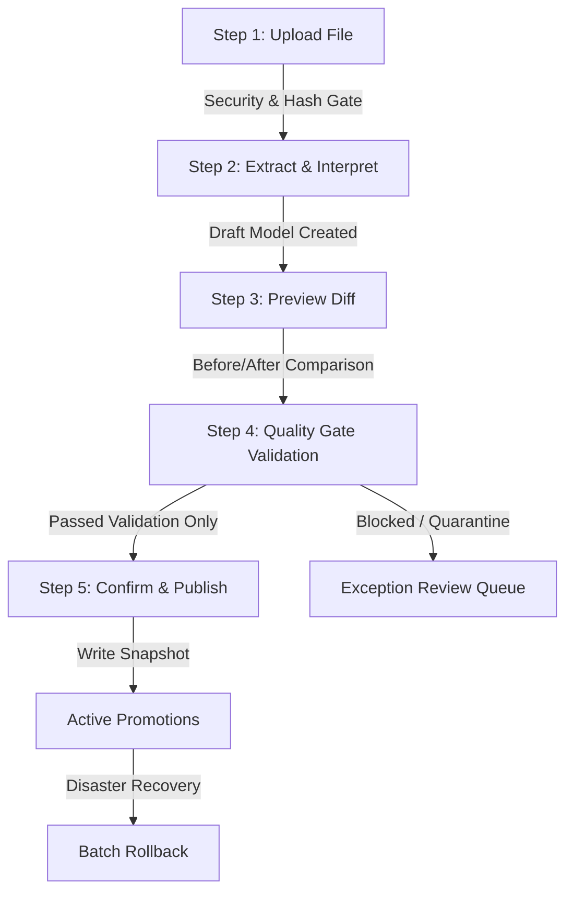
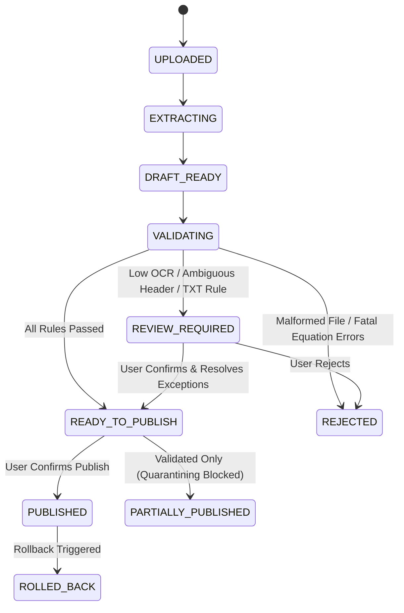

# Promotion Import Center — Architecture & Implementation Specification

## 1. Executive Summary & Problem Context
The **Promotion Import Center** (`/#/promotion-import`) provides a deterministic, staging-gated workflow for branch staff to import, inspect, validate, and publish promotional campaigns across three input formats:
1. **Excel (`.xlsx`)**: High automation via Header-Guided Left-to-Right parser.
2. **Images (`.png`, `.jpg`, `.jpeg`, `.webp`)**: OCR Drafts (`DRAFT_FROM_OCR`) requiring mandatory human review. **Auto-Publish is strictly prohibited.**
3. **Branch Text (`.txt`)**: Text-based rule interpretation (`BRANCH_RULE_DRAFT`) requiring store manager compilation and Rule Engine clearance. **Direct Master overwrite is strictly prohibited.**

This module eliminates ad-hoc data editing and eliminates unvetted script executions by enforcing a **5-Step Staging Pipeline** with comprehensive rollback capabilities.

---

## 2. 5-Step Staging Workflow

### Step 1: Upload & Security Verification
Every upload undergoes mandatory pre-flight checks:
- **Allowed Extensions**: `.xlsx`, `.png`, `.jpg`, `.jpeg`, `.webp`, `.txt`.
- **MIME & Magic Bytes**: Verifies standard headers (`PK\x03\x04` for xlsx, `\x89PNG` for PNG, `\xff\xd8\xff` for JPEG, `RIFF...WEBP` for WebP).
- **Macro Code Detection**: Scans `.xlsx` packages for embedded VBA projects (`xl/vbaProject.bin`).
- **File Size Limit**: Hard ceiling of 15MB.
- **SHA-256 Checksum**: Prevents accidental double-uploads of identical files.
- **Filename Sanitization**: Cleans malicious characters while preserving Thai alphanumeric characters.

### Step 2: Extract
- **Excel**:
  - Uses Header-Guided Left-to-Right reading.
  - Matches Exact `P/N` (SM-, F-, EP-, EF- prefixes) before model strings.
  - Resolves merged header hierarchies and captures formula text alongside cached values.
- **Images**:
  - Optical Character Recognition extracts candidate model names, P/N, price tags, and coupon identifiers.
  - Generates confidence scores per field.
  - Always assigned state `DRAFT_FROM_OCR`.
- **Text (`.txt`)**:
  - Natural language rule parser extracts patterns (e.g. `Z Flip8 256GB Trade Up ลด 5,000 เหลือ 37,900`).
  - Always assigned state `BRANCH_RULE_DRAFT`.

### Step 3: Preview Diff
Before altering any branch pricing, the dashboard renders a field-level difference view:
- Existing Value vs. Proposed Value (RRP, Net Price, Discount, Coupon, Sale Mode, Expiry).
- Granular Summary:
  - Total rows parsed
  - New variants detected
  - Updated variants
  - Unchanged items
  - Missing P/N warnings
  - Duplicate P/N in batch
  - Expired / Future promotions
  - Price equation failures
  - Low OCR confidence flags
  - Blocked items

### Step 4: Quality Gate Validation
The batch is evaluated against the 10 core branch rules:
1. **Exact P/N Gate**: Validates SKU structure and ensures separation between standard devices (`SM-`) and Pass F (`F-`).
2. **Product Code Type Gate**: `STANDARD_SM`, `PASS_F`, `BOM_SET`, `STANDARD_ACCESSORY`.
3. **Price Equation Gate**: Enforces $\text{RRP} - \text{Discount} = \text{Net Price}$.
4. **Sale Mode Gate**: Validates compatibility of `STANDARD`, `TRADE_UP`, `STUDENT`, `SF_PLUS`.
5. **Coupon Gate**: Validates coupon codes (e.g., `CPN01`, `CPN04`, `CPN06`).
6. **Date Gate**: Validates start and end dates against current branch date.
7. **Batch Consistency Gate**: Prevents contradicting prices for identical variants within the same batch.
8. **Runtime Hash Gate**: Validates source trace hash.
9. **Golden Tests Gate**: Enforces test assertions for known anchor SKUs.
10. **Human Review Gate**: Mandatory for all OCR and TXT inputs.

### Step 5: Confirm & Publish
- User must inspect the validation summary.
- **Publish Eligible**: `PASSED_VALIDATION`, and user-confirmed `WARNING`.
- **Blocked from Publish**: `BLOCKED_INVALID`, `BLOCKED_UNPROVEN`, `SOURCE_CONFLICT`, `HEADER_AMBIGUOUS`, `OCR_LOW_CONFIDENCE`.
- Idempotency key generated to prevent double-submissions.
- Previous batch state snapshot archived for instant one-click rollback.

---

## 3. State Transition Model

---

## 4. Storage Architecture & Offline Persistence
In Phase 1, branch operations lack a central cloud database:
- **Store Implementation**: `IndexedDbDraftStore` under database `SamsungBranchDb_v1`.
- **Storage Tag**: Marked with `LOCAL_BROWSER_ONLY`.
- **Storage Notice in UI**:
  > ⚠️ **LOCAL_BROWSER_ONLY**: ข้อมูลถูกจัดเก็บในหน่วยความจำเบราว์เซอร์เครื่องนี้เท่านั้น ยังไม่ได้กระจายไปยังอุปกรณ์อื่นอัตโนมัติ
- **Extensible Adapters**:
  - `IndexedDbDraftStore` (Active)
  - `ApiDraftStore` (Interface defined for future central microservice)
  - `FutureDatabaseStore` (Reserved)
