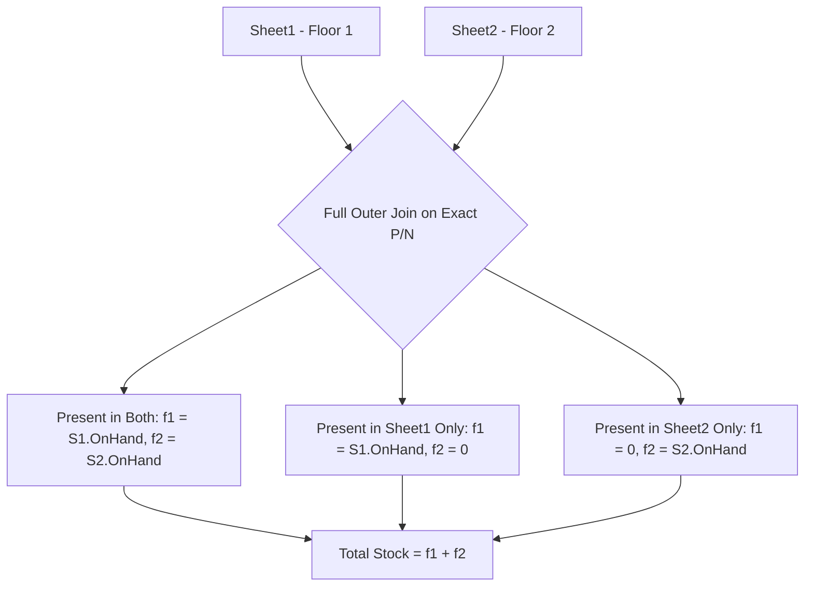

# Stock Import Center Architectural Design & Specification

> **System**: Samsung Branch Operations - Stock Management Module  
> **Route**: `/#/stock-import` and `/#/stock-import-history`  
> **Input File**: Microsoft Excel (`.xlsx`)  
> **Status**: `IMPLEMENTED_AND_VERIFIED`  
> **Reference File**: `C:\Users\JarNJay\Desktop\Stock.xlsx`

---

## 1. Executive Summary

The Stock Import Center provides a secure, deterministic, and verifiable pipeline to ingest store inventory without automated Nimbus integrations. It replaces ad-hoc data editing with a structured 4-step workflow:
$$\text{Upload .xlsx} \longrightarrow \text{Full Outer Join Validation} \longrightarrow \text{Preview Diff} \longrightarrow \text{Confirm \& Create Snapshot}$$

### Core Operating Realities
- **Stock Source**: `STATIC_EXCEL_SNAPSHOT`
- **Auto Sync**: `NOT_IMPLEMENTED`
- **Nimbus API Connection**: `NOT_CONFIGURED`
- **Persistence Mode**: `LOCAL_BROWSER_ONLY (Phase 1)` via IndexedDB with export capability.

---

## 2. Two-Sheet Data Mapping Specification

The input workbook (`Stock.xlsx`) is structured with two floor sheets representing physical store locations:

| Source Sheet | Store Location | Destination Column | Quantity Column Used |
| :--- | :--- | :--- | :--- |
| **`Sheet1`** | ร้านเรา ชั้น 1 | `f1` | **`On Hand` only** |
| **`Sheet2`** | สาขา ชั้น 2 | `f2` | **`On Hand` only** |

### Column Layout & System Mapping (Row 4 Header)
```
Col 1:  Cat1        -> category1
Col 2:  Cat2        -> category2
Col 3:  Cat3        -> category3
Col 4:  Brand       -> brand
Col 5:  Price 99    -> stockReferencePrice
Col 6:  P/N         -> pn (EXACT PRODUCT KEY)
Col 7:  KOAN SKU    -> koanSku
Col 8:  Apple Part  -> applePart
Col 9:  Description -> description
Col 10: On Hand     -> Physical On-Hand Stock (f1 / f2)
Col 11: On B/R      -> onBackReserve (Metadata Only)
Col 12: On Alloc    -> onAllocated (Metadata Only)
Col 13: On T/F      -> onTransfer (Metadata Only)
```

> [!CRITICAL]
> **Columns Prohibited from Available Stock**:
> `On B/R`, `On Alloc`, and `On T/F` represent back-orders, customer allocations, and goods in transit. They **must never** be summed into `On Hand`.

---

## 3. Full Outer Join Merge Algorithm

Because inventory can exist exclusively on Floor 1, exclusively on Floor 2, or on both floors, the merge engine performs a strict **Full Outer Join by Exact P/N**:



### Empirical Verification on `C:\Users\JarNJay\Desktop\Stock.xlsx`:
- **Unique P/N in Sheet1**: 336 SKUs ($f_1 = 1,763$ units)
- **Unique P/N in Sheet2**: 337 SKUs ($f_2 = 1,649$ units)
- **Matched on Both Floors**: **274 SKUs**
- **Floor 1 Only**: **62 SKUs**
- **Floor 2 Only**: **63 SKUs**
- **Total Unique Merged SKUs**: **399 SKUs**
- **Grand Total Stock**: **3,412 units** ($1,763 + 1,649 = 3,412$)

---

## 4. Price Separation Rule

- **`stockReferencePrice`**: Extracted directly from `Price 99` of `Stock.xlsx` (e.g. A07 4/64GB = 5,499 THB, A07 4/128GB = 6,999 THB).
- **`promotionRrp` & `promotionNetPrice`**: Derived strictly from the promotion pipeline and rule engine.
- **Isolation Principle**: `Price 99` is an informational reference. It **must never** overwrite promotional retail prices. Price differences between stock reference and promotion catalog trigger `STOCK_PRICE_PROMOTION_PRICE_DIFFERENCE` without blocking inventory ingestion.

---

## 5. Security, Validation, & Rollback

### Data Quality Rules
1. **P/N Required & Trimmed**: Blank P/N rows are rejected (`MISSING_PN`).
2. **Duplicate P/N Isolation**: Duplicate P/Ns within a single sheet are flagged (`DUPLICATE_PN_IN_SHEET`).
3. **Integer Non-Negative**: `On Hand` must be an integer $\ge 0$. Negative values trigger `NEGATIVE_ON_HAND` and are blocked.
4. **Zero Preservation**: On Hand value 0 is preserved as integer `0` (never replaced by null or empty string).
5. **Equation Enforcement**: $Total = f_1 + f_2$ is enforced across 100% of rows.

### Rollback Strategy
Each confirmed import creates an immutable snapshot:
- `currentSnapshot`: The active stock table displayed on the dashboard.
- `previousSnapshot`: The backup snapshot held in reserve.
Clicking **`Rollback`** reverts the dashboard to `previousSnapshot` and logs a `ROLLED_BACK` audit event.
