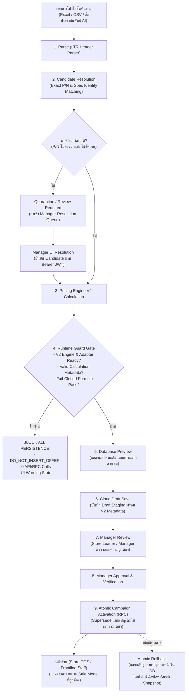

# ดัชนีเอกสาร Markdown และคู่มือกระบวนการทำงานทั้งระบบ (System Workflow & MD Index)
**โครงการ:** Samsung Branch Operations Dashboard (สาขา Ayutthaya City Park)  
**สถานะระบบ:** Pilot Cloud Alias LIVE (`https://samsung-stock-pilot.vercel.app`) • Deployment Target: PREVIEW  
**สถานะทางธุรกิจ:** Active Business Offers = 0 • Daily Store Usage = HOLD  

---

## สารบัญ (Table of Contents)
1. [ดัชนีไฟล์เอกสาร Markdown ทั้งหมดในระบบ](#1-ดัชนีไฟล์เอกสาร-markdown-ทั้งหมดในระบบ)
2. [ภาพรวมสถาปัตยกรรมและ Flow ทั้งระบบ (End-to-End System Workflow)](#2-ภาพรวมสถาปัตยกรรมและ-flow-ทั้งระบบ-end-to-end-system-workflow)
3. [กระบวนการนำเข้าและตรวจสอบข้อมูล (Data Ingestion & Extraction Workflow)](#3-กระบวนการนำเข้าและตรวจสอบข้อมูล-data-ingestion--extraction-workflow)
4. [กระบวนการคำนวณราคาและแยกประเภทสิทธิ์ (Promotion Pricing Engine V2 Workflow)](#4-กระบวนการคำนวณราคาและแยกประเภทสิทธิ์-promotion-pricing-engine-v2-workflow)
5. [กระบวนการระงับความเสี่ยงและการอนุมัติโดยผู้จัดการ (Quarantine & Manager Resolution Workflow)](#5-กระบวนการระงับความเสี่ยงและการอนุมัติโดยผู้จัดการ-quarantine--manager-resolution-workflow)
6. [วงจรชีวิตแคมเปญและการ Rollback (Campaign Lifecycle & Atomic Rollback)](#6-วงจรชีวิตแคมเปญและการ-rollback-campaign-lifecycle--atomic-rollback)
7. [กระบวนการ CI/CD และ Two-Stage Quality Gates (Deployment Pipeline)](#7-กระบวนการ-cicd-และ-two-stage-quality-gates-deployment-pipeline)

---

## 1. ดัชนีไฟล์เอกสาร Markdown ทั้งหมดในระบบ

### 1.1 เอกสารหลักระดับ Root (Ground Truth & Business Rules)
* [README.md](file:///c:/Users/JarNJay/.gemini/antigravity-ide/scratch/samsung-stock-dashboard/README.md) — ภาพรวมระบบ, โครงสร้างไดเรกทอรี, กฎเหล็กทางธุรกิจ และคำสั่งทดสอบระบบ
* [branch_confirmed_rules.md](file:///c:/Users/JarNJay/.gemini/antigravity-ide/scratch/samsung-stock-dashboard/branch_confirmed_rules.md) — กฎโปรโมชั่นสาขาที่ได้รับการยืนยันแล้ว (Canonical 6 Sale Modes, การแยกพาส SM- vs F-, และ Golden Rules รายรุ่น)
* [active_promotion_report.md](file:///c:/Users/JarNJay/.gemini/antigravity-ide/scratch/samsung-stock-dashboard/active_promotion_report.md) — รายงานการตรวจสอบความถูกต้องของรายการโปรโมชั่นและการจับคู่ราคา
* [AI_AUDIT_README.md](file:///c:/Users/JarNJay/.gemini/antigravity-ide/scratch/samsung-stock-dashboard/AI_AUDIT_README.md) — คู่มือและมาตรฐานการตรวจสอบโค้ดและข้อมูลด้วย AI Audit Engine

### 1.2 เอกสารนโยบายและชุดข้อมูลสำหรับ NotebookLM (`notebooklm-export/` & `policies/`)
* [notebooklm-export/README_FIRST.md](file:///c:/Users/JarNJay/.gemini/antigravity-ide/scratch/samsung-stock-dashboard/notebooklm-export/README_FIRST.md) — ลำดับความสำคัญในการอ่านเอกสารสำหรับ AI & NotebookLM
* [notebooklm-export/current/sale_mode_guide.md](file:///c:/Users/JarNJay/.gemini/antigravity-ide/scratch/samsung-stock-dashboard/notebooklm-export/current/sale_mode_guide.md) — คู่มือ Canonical 6 Sale Modes (STANDARD_PAYMENT, SF_PLUS, NON_SF_PLUS, STUDENT_EXCLUSIVE, TRADE_UP, BUNDLE_PURCHASE)
* [notebooklm-export/current/coupon_guide.md](file:///c:/Users/JarNJay/.gemini/antigravity-ide/scratch/samsung-stock-dashboard/notebooklm-export/current/coupon_guide.md) — คู่มือการใช้รหัสคูปอง (Coupon 01, 04, Studentcrd และข้อกำหนดห้ามใช้คูปองใน Trade Up)
* [notebooklm-export/current/promotion_summary.md](file:///c:/Users/JarNJay/.gemini/antigravity-ide/scratch/samsung-stock-dashboard/notebooklm-export/current/promotion_summary.md) — สรุปโปรโมชั่นและส่วนลดตามกลุ่มสินค้า
* [policies/notebooklm_answering_rules.md](file:///c:/Users/JarNJay/.gemini/antigravity-ide/scratch/samsung-stock-dashboard/policies/notebooklm_answering_rules.md) — กฎการตอบคำถามโดยอิงจาก Ground Truth เท่านั้น ห้ามอนุมานตัวเลข
* [policies/notebooklm_data_scope.md](file:///c:/Users/JarNJay/.gemini/antigravity-ide/scratch/samsung-stock-dashboard/policies/notebooklm_data_scope.md) — ขอบเขตข้อมูลที่อนุญาตให้ใช้งาน (สาขาอยุธยา ซิตี้ พาร์ค)
* [policies/notebooklm_readonly_contract.md](file:///c:/Users/JarNJay/.gemini/antigravity-ide/scratch/samsung-stock-dashboard/policies/notebooklm_readonly_contract.md) — สัญญาการใช้งานแบบอ่านอย่างเดียว ป้องกันการแก้ไขข้อมูลสต็อกหลัก

### 1.3 รายงานสถาปัตยกรรมและการตรวจรับระบบ (`reports/`)
* [reports/architecture_direction_record.md](file:///c:/Users/JarNJay/.gemini/antigravity-ide/scratch/samsung-stock-dashboard/reports/architecture_direction_record.md) — บันทึกการตัดสินใจทางสถาปัตยกรรมระบบ (ADR)
* [reports/promotion_import_design.md](file:///c:/Users/JarNJay/.gemini/antigravity-ide/scratch/samsung-stock-dashboard/reports/promotion_import_design.md) — การออกแบบระบบนำเข้าโปรโมชั่น 5-Stage Gate
* [reports/stock_import_design.md](file:///c:/Users/JarNJay/.gemini/antigravity-ide/scratch/samsung-stock-dashboard/reports/stock_import_design.md) — การออกแบบระบบนำเข้าสต็อกและตรวจสอบสมการความคงอยู่ (Total = F1 + F2)
* [reports/ai_promotion_capture_contract.md](file:///c:/Users/JarNJay/.gemini/antigravity-ide/scratch/samsung-stock-dashboard/reports/ai_promotion_capture_contract.md) — สัญญาการรับข้อมูลโปรโมชั่นชั่วคราวจาก AI (AI Provisional Ingestion)
* [reports/parser_responsibility_map.md](file:///c:/Users/JarNJay/.gemini/antigravity-ide/scratch/samsung-stock-dashboard/reports/parser_responsibility_map.md) — การแบ่งหน้าที่การแปลงข้อมูลตาราง (Header-Guided vs Cell-Reading)
* [reports/it_architecture_decision_pending.md](file:///c:/Users/JarNJay/.gemini/antigravity-ide/scratch/samsung-stock-dashboard/reports/it_architecture_decision_pending.md) — รายการการตัดสินใจทางสถาปัตยกรรมที่รอการพิจารณา
* [reports/monitoring_data_policy.md](file:///c:/Users/JarNJay/.gemini/antigravity-ide/scratch/samsung-stock-dashboard/reports/monitoring_data_policy.md) — นโยบายการตรวจสอบและบันทึกประวัติการเปลี่ยนแปลงราคา
* [reports/phase_a_walkthrough.md](file:///c:/Users/JarNJay/.gemini/antigravity-ide/scratch/samsung-stock-dashboard/reports/phase_a_walkthrough.md) — สรุปผลงานและเส้นทางการทำงานของระบบ Phase A
* [reports/phase_b_completion_report.md](file:///c:/Users/JarNJay/.gemini/antigravity-ide/scratch/samsung-stock-dashboard/reports/phase_b_completion_report.md) — รายงานความสมบูรณ์ของ Phase B และระบบสิทธิ์ 4 บทบาท

---

## 2. ภาพรวมสถาปัตยกรรมและ Flow ทั้งระบบ (End-to-End System Workflow)



---

## 3. กระบวนการนำเข้าและตรวจสอบข้อมูล (Data Ingestion & Extraction Workflow)

1. **การอ่านหัวตารางแบบ 2 ทิศทาง (Header-Guided Left-to-Right Analysis)**:
   - สกัดบริบทจากหัวตาราง 2 มิติ (Row Header + Column Header)
   - ไม่เดาข้อมูลจากชื่อโปรโมชั่น หากคอลัมน์ไม่ระบุเงื่อนไข
2. **การจำแนกประเภท P/N (Product Code Type Classification)**:
   - `SM-` = เครื่องเปล่ามาตรฐาน (ห้ามดึงโปรโมชั่นพาส F มาใช้เด็ดขาด)
   - `F-` = พาส F / ชุดเปิดตัวพิเศษ (สิทธิ์อัปเกรดความจุเฉพาะรุ่น)
   - `EP-`, `EF-`, `GP-`, `ET-`, `EJ-` = อุปกรณ์เสริม (ห้ามนำมาจับคู่เป็น P/N หลักของโปรโมชั่นโทรศัพท์)
3. **การจับคู่ P/N (Exact P/N Gate)**:
   - หากไฟล์ระบุ P/N ตรงกับสต็อกสาขา $\rightarrow$ ผ่านเข้าสู่ขั้นตอนคำนวณ
   - หากระบุเฉพาะชื่อรุ่นและความจุ $\rightarrow$ แสดงรายการ Candidate P/N ตามสีจริงในสต็อก เพื่อให้พนักงานกดยืนยันก่อนเผยแพร่
   - หากไม่พบในสต็อกสาขา $\rightarrow$ กักกันสถานะ `REVIEW_REQUIRED` (Fail-Closed)

---

## 4. กระบวนการคำนวณราคาและแยกประเภทสิทธิ์ (Canonical 6 Sale Modes)

ระบบบังคับใช้สูตรคำนวณราคามาตรฐานและแยกคอลัมน์การแสดงผลอย่างโปร่งใสตาม Canonical 6 Sale Modes:

### 4.1 ซื้อปกติ (STANDARD_PAYMENT)
* **สูตร:**
  ```text
  NetPrice = RRP - StandardDiscount
  ```
* **การแสดงผล:** ส่วนลดซื้อปกติ `-฿5,000` | โบนัส Trade Up `-` | ราคาที่ลูกค้าชำระ `฿49,900` | คูปอง `01`

### 4.2 ร่วม Samsung Finance+ (SF_PLUS)
* **สูตร:**
  ```text
  FinanceContractPrice = RRP - FinanceDiscount
  FinancePrincipal = FinanceContractPrice - DownPayment
  ```
* **กฎสำคัญ:** เงินดาวน์ **ไม่ใช่ส่วนลด** และยอดจัดสินเชื่อ **ไม่ใช่ราคาสินค้า** ห้ามนำเงินดาวน์มาหักเป็นส่วนลดสินค้า หากผู้ใช้ยังไม่ได้เลือกเงินดาวน์ ระบบจะแสดงเงินดาวน์และยอดจัดเป็น `รอเลือก` (`DOWN_PAYMENT_SELECTION_REQUIRED`) และไม่อนุญาตให้บันทึก Cloud Draft จนกว่าจะมีค่าชัดเจน

### 4.3 ไม่ร่วม Samsung Finance+ (NON_SF_PLUS)
* **สูตร:**
  ```text
  NetPrice = RRP - NonSFDiscount
  ```
* **กฎสำคัญ:** ใช้สำหรับแผนการผ่อนชำระผ่านบัตรเครดิตหรือช่องทางอื่นที่ไม่ใช่ SF+

### 4.4 โปรโมชั่นนักศึกษา (STUDENT_EXCLUSIVE)
* **สูตร:**
  ```text
  StudentDiscount = RRP × StudentDiscountPercent ÷ 100
  NetPrice = RRP - StudentDiscount
  ```
* **กฎสำคัญ:** ต้องใช้คูปอง `Studentcrd` เท่านั้น และมีนโยบาย `EXCLUSIVE` ห้ามซ้อนส่วนลดซื้อปกติหรือ Trade Up

### 4.5 เก่าแลกใหม่ (TRADE_UP)
Trade Up ประกอบด้วย 3 องค์ประกอบที่ต้องแยกจากกันอย่างเด็ดขาด:
1. ส่วนลดซื้อปกติของเครื่องใหม่ (Standard Discount)
2. โบนัส Trade Up ของเครื่องใหม่ (Trade Up Bonus)
3. มูลค่าเครื่องเก่าที่ประเมินได้ ณ จุดขาย (Trade-In Appraised Value)

* **สูตรหน้าโปรโมชั่น (ราคาก่อนประเมินเครื่องเก่า):**
  ```text
  PriceBeforeAppraisal = RRP - StandardDiscount - TradeUpBonus
  ```
* **สูตรหน้าชำระเงิน (ยอดปิดบิลสุดท้าย):**
  ```text
  FinalCheckoutAmount = PriceBeforeAppraisal - TradeInAppraisedValue + Fees
  ```
* **กฎเหล็ก Trade Up:**
  - `requires_trade_in = true` (ต้องมีเครื่องเก่ารุ่นที่ร่วมรายการมาเทริน)
  - `trade_up_bonus_amount > 0`
  - `trade_up_coupon_code = null` (Trade Up **ไม่มีคูปองของตัวเอง**)
  - `trade_up_payment_code = null` (Trade Up **ไม่มี Payment Code**)
  - คูปอง `01` บนแถว Trade Up เป็นของส่วนลดซื้อปกติเท่านั้น ห้ามทำให้เข้าใจว่า 01 คือคูปอง Trade Up

### 4.6 ซื้อพ่วง (BUNDLE_PURCHASE)
* **สูตร:**
  ```text
  BundleTotal = PrimaryProductNet + Σ(BundleItemNet)
  ```
* **กฎสำคัญ:** คำนวณราคาสุทธิของสินค้าหลักรวมกับสินค้าพ่วงแต่ละรายการอย่างโปร่งใส

---

## 5. กระบวนการระงับความเสี่ยงและการอนุมัติโดยผู้จัดการ (Quarantine & Manager Resolution Workflow)

1. **Fail-Closed Triggers (สั่งระงับและห้ามบันทึกทันที):**
   - RRP ไม่มีค่า หรือ RRP <= 0
   - ส่วนลดรายการใดติดลบ
   - ผลรวมส่วนลดมากกว่า RRP
   - NetPrice < 0
   - FinancePrincipal < 0
   - FinalCheckoutAmount < 0
   - Pricing Engine V2 หรือ Adapter ไม่พร้อม
2. **Manager Resolution Security:**
   - การแก้ไขแถวที่ถูกกักกันต้องกระทำผ่าน UI จัดการ และยืนยันตัวตนด้วย Bearer JWT
   - บังคับตรวจสิทธิ์ระดับบทบาท (`STORE_LEADER`, `STORE_MANAGER`, `SYSTEM_ADMIN`)
   - ระบบบันทึก `verifiedUser.id`, เวลาที่แก้ไข, เหตุผล และรหัสความละเอียด (Resolution Code) เพื่อการตรวจสอบย้อนกลับ (Immutable Audit Trail)

---

## 6. วงจรชีวิตแคมเปญและการ Rollback (Campaign Lifecycle & Atomic Rollback)

`
[Parse & Resolve] ──► [Pricing Engine V2] ──► [Runtime Guard] ──► [Database Preview] ──► [Cloud Draft] ──► [Manager Review] ──► [Atomic Activation RPC] ──► [ACTIVE]
                                                                                                                                                           │
                                                                                              [Rollback Previous Hash] ◄────┘
`
* **สถานะความปลอดภัยปัจจุบัน:**
  - `Active Business Offers = 0` (ยังไม่มีแคมเปญจริงที่เปิด Active)
  - `Business Promotion Activation = HOLD`
  - `Store Daily Usage = HOLD`
* **ระบบ Rollback ทันที (Atomic Rollback):**
  - หากพบข้อผิดพลาดหลังการเปิดใช้งาน ผู้จัดการสามารถสั่ง Rollback ผ่าน API `/api/promotion-campaigns/:id/rollback`
  - ระบบออกแบบให้ Rollback แคมเปญผ่านธุรกรรมฐานข้อมูล โดยไม่แก้ Active Stock Snapshot

---

## 7. กระบวนการ CI/CD และ Two-Stage Quality Gates (Deployment Pipeline)

การส่งมอบระบบควบคุมด้วยเกณฑ์คุณภาพ 2 ขั้นตอน (Decoupled Two-Stage Gate):

### ขั้นตอนที่ 1: PRE_DEPLOY_STATIC_GATE
* รันชุดทดสอบความถูกต้องของข้อมูลและโค้ด 20 ข้อ (`python scripts/ci_quality_gate.py`):
  1. `RULE-01-FORMULA-ERROR` (0 ข้อผิดพลาดสูตร)
  2. `RULE-02-PRICE-EQUATION` (ความถูกต้องทางคณิตศาสตร์ Net = RRP - Discount)
  3. `RULE-03-STUDENT-RULE` (Studentcrd Exclusive)
  4. `RULE-04-PASS-F-ISOLATION` (แยกพาส SM- และ F- เด็ดขาด)
  5. `RULE-05-TRADE-UP-ISOLATION` (แยก Trade Up จากราคาซื้อปกติ)
  6. `RULE-06-STOCK-SUM` (สมการ Total = F1 + F2)
  7. `RULE-07-A07-GOLDEN` (เคสทดสอบ Galaxy A07 Ground Truth)
  8. `RULE-08-SECRET-LEAK` (สแกนรหัสลับและ Credential รั่วไหล)
  9. `GATE-EXACT-PN` (ความถูกต้องของ P/N 142 Active + 56 Drafts)
  10. `GATE-BATCH-CONSISTENCY` (ความสอดคล้องของ Batch ID)
  11. `GATE-RUNTIME-HASH` (ตรวจสอบ SHA256 ของไฟล์ Runtime ทั้ง 23 ไฟล์)
  12. `RULE-09` ถึง `RULE-17` (Product Identity, Accessory Master, Sales Readiness, Manager Resolution Security)
* ผ่านแล้วได้สถานะ: `READY_FOR_PREVIEW_DEPLOYMENT`

### ขั้นตอนที่ 2: POST_DEPLOY_LIVE_GATE
* สร้างและตรวจสอบ Runtime Package Zip (`python scripts/verify_pilot_zip.py`)
* Deploy ขึ้นสู่ Vercel Preview Deployment
* ตั้งค่า Vercel Alias ไปที่ `https://samsung-stock-pilot.vercel.app`
* รัน E2E Browser Test (Playwright) ตรวจสอบการเรนเดอร์หน้าจอจริง (เช่น [trade_up_separated_presentation.png](file:///C:/Users/JarNJay/.gemini/antigravity-ide/brain/c19c8d25-d132-4398-ae85-f90b289e1b75/trade_up_separated_presentation.png))
* ผ่านแล้วได้สถานะ: `READY_FOR_INTERNAL_PILOT` (อนุญาตเฉพาะการทดสอบภายในกลุ่ม Pilot 4 ผู้ใช้)
